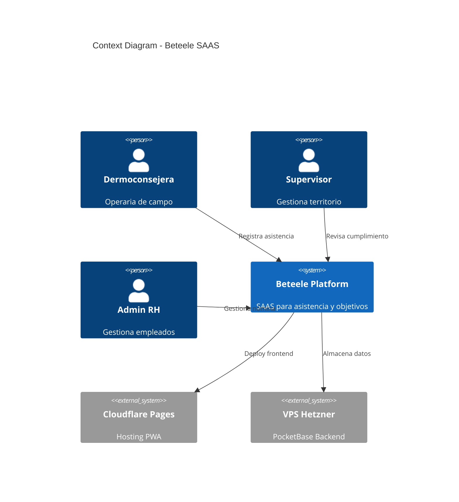
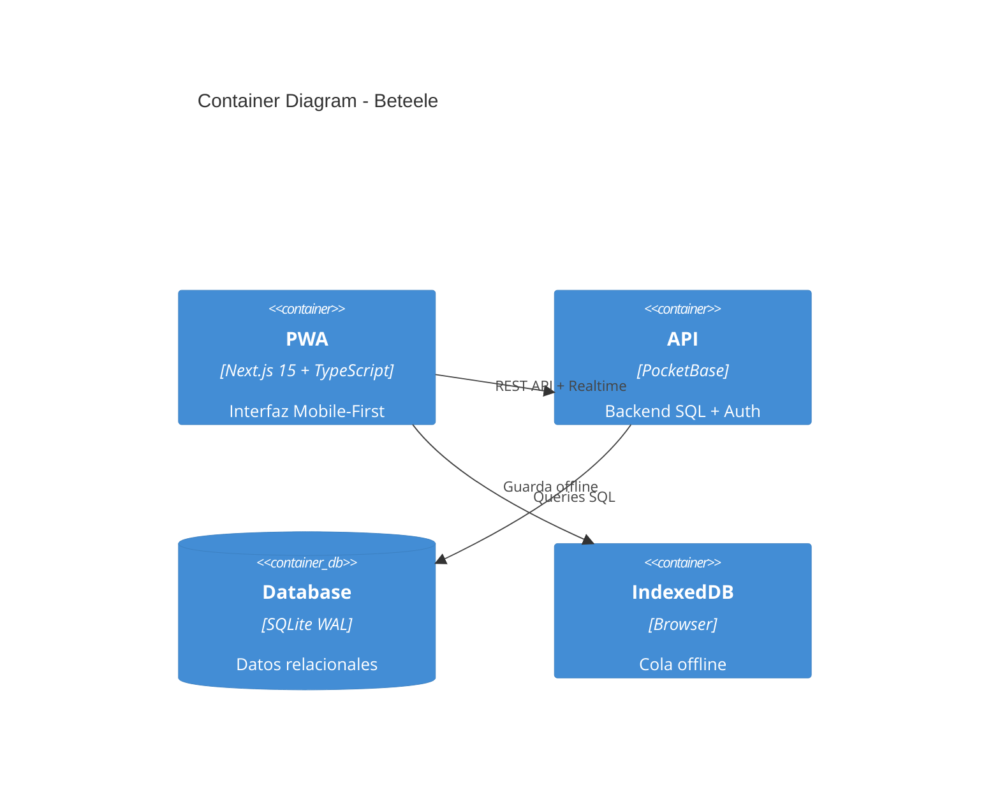
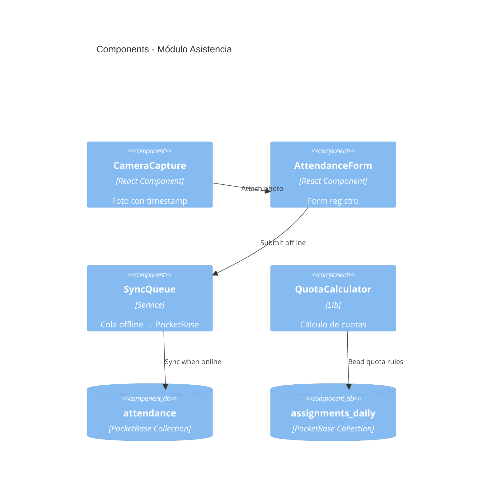

# C4 Architecture Documentation

## Cuando Usar
- Al inicio de features grandes (ej. módulo RH)
- Onboarding de nuevos desarrolladores
- Cambios en arquitectura core (ej. migración Firebase → PocketBase)
- Auditorías técnicas

## Nivel 1: Context Diagram

## Nivel 2: Container Diagram

## Nivel 3: Component Diagram (Módulo Asistencia)

