# Design Document: Field Force Platform

## Overview

Field Force Platform es una plataforma de gestión de fuerza de campo que convierte la actividad operativa de promotores en datos irrefutables. Resuelve fraude/ausentismo, disputas de nómina, pérdida de información comercial y cuotas injustas por rotación.

La plataforma se compone de tres capas de presentación (App Móvil iOS/Android, Dashboard Web, API pública para CLIENTE) sobre un backend de microservicios con dominio bien delimitado. Los módulos críticos —Motor de Nómina, Motor de Cuotas, Validador GPS/Biométrico, Catálogo de Misiones del Día, Flujo de Incapacidades y Jerarquía de Horarios— se diseñan como servicios internos con contratos explícitos para garantizar la inmutabilidad de reglas de negocio.


## Agent Engineering Policy

El repositorio adopta un flujo de implementacion asistido por skills locales. Todo agente que planifique, implemente, depure, pruebe, revise o reconcilie trabajo en este proyecto debe consultar y aplicar las skills relevantes ubicadas en `.claude/skills/` antes de modificar codigo o marcar avance.

### Mandatory Skill Families

- `09-encoding/utf8-standard`
  - Uso obligatorio cuando se lean, editen o reconcilien documentos, migraciones, seeds o archivos de configuracion.
- `05-code-review/typescript-strict-typing`
  - Uso obligatorio en cambios de tipado TypeScript, clientes de Supabase, contratos de datos y eliminacion de `any`.
- `06-performance/offline-sync-patterns`
  - Uso obligatorio en cualquier cambio de cola offline, sincronizacion, IndexedDB, reintentos o resolucion de conflictos.
- `01-testing-tdd/pwa-service-worker`
  - Uso obligatorio en cambios de manifest, service worker, estrategias de cache e instalacion PWA.
- `02-testing-e2e/playwright-testing`
  - Uso obligatorio cuando se agreguen o modifiquen flujos criticos de UI, paneles operativos o cobertura e2e.
- `02-testing-e2e/tailwind-mobile-first`
  - Uso obligatorio en cambios de vistas moviles, compactas o layouts de operacion en campo.
- `03-debugging/systematic-debugging`
  - Uso obligatorio cuando exista un bloqueo tecnico no trivial, fallo intermitente o regresion no explicada.
- `06-performance/sql-indexing-strategy`
  - Uso obligatorio al introducir tablas, consultas nuevas, filtros frecuentes o cambios de indices/migraciones SQL.

### Application Rule

Antes de ejecutar trabajo sustancial, el agente debe:

1. Identificar que skill(s) aplican al cambio.
2. Leer las `SKILL.md` relevantes.
3. Ejecutar el trabajo alineado con esas guias.
4. Reflejar en el historial o en la reconciliacion cuando una skill haya condicionado decisiones importantes.
5. Preservar UTF-8 sin BOM y line endings LF en cualquier documento, migracion, seed o archivo de configuracion tocado.
6. Ejecutar `npm run docs:check-encoding` antes de cerrar una iteracion que haya modificado archivos sensibles a codificacion.

No se permite ignorar una skill relevante por conveniencia. Si una skill entra en conflicto con la especificacion canonica, prevalece esta especificacion y el conflicto debe registrarse explicitamente.

### Encoding Guardrail

La proteccion de encoding es una regla operativa irrompible para todos los agentes del proyecto:

- Se debe respetar `.gitattributes` y `.editorconfig` para mantener UTF-8 sin BOM y LF.
- Queda prohibido reserializar archivos sensibles con flujos no deterministas de PowerShell como `Get-Content ... | Set-Content ...`.
- Si `npm run docs:check-encoding` detecta mojibake, BOM o caracteres de control, el agente no debe cerrar la iteracion hasta corregirlos.

### Reconciliation Guardrail

La reconciliacion del backlog canonico debe mantenerse conservadora y verificable:

- Un agente no debe marcar nuevos items como completos en `tasks.md` sin trabajo real staged en implementacion, migraciones, seeds, scripts o pruebas.
- El hook local puede bloquear ese commit solo en ese caso; no debe convertirse en una barrera general para commits de documentacion o mantenimiento.

### Context Compact Guardrail

La continuidad multi-agente requiere compactacion antes de perder contexto:

- Si una iteracion larga se acerca a saturacion operativa de contexto, el agente debe resumir estado real, decisiones, validaciones, bloqueos y siguiente corte en documentos derivados.
- La compactacion debe hacerse antes de entrar en zona de riesgo alta; no esperar a una perdida efectiva de continuidad.
### Skill-to-Backlog Matrix

| Backlog area | Skills obligatorias | Uso esperado |
|---|---|---|
| Fase 0 - Fundacion (documentos, seeds, migraciones, setup base) | `09-encoding/utf8-standard`, `06-performance/sql-indexing-strategy`, `05-code-review/typescript-strict-typing` | Proteger UTF-8, definir esquemas e indices, endurecer contratos TS y Supabase |
| Fase 1 - Auth y usuarios | `05-code-review/typescript-strict-typing`, `03-debugging/systematic-debugging`, `02-testing-e2e/playwright-testing` | Roles, claims, sesiones, paneles criticos y pruebas de flujo |
| Fase 2 - Estructura maestra y reglas | `06-performance/sql-indexing-strategy`, `05-code-review/typescript-strict-typing`, `03-debugging/systematic-debugging` | Tablas maestras, reglas de negocio, consultas frecuentes y depuracion de integracion |
| Fase 3 - Planeacion operativa | `05-code-review/typescript-strict-typing`, `02-testing-e2e/playwright-testing`, `06-performance/sql-indexing-strategy` | Asignaciones, rutas, campanas, formaciones y cobertura de paneles/queries |
| Fase 4 - PWA y operacion diaria | `01-testing-tdd/pwa-service-worker`, `06-performance/offline-sync-patterns`, `02-testing-e2e/tailwind-mobile-first`, `02-testing-e2e/playwright-testing`, `03-debugging/systematic-debugging` | Service worker, offline queue, vistas compactas, UX movil y depuracion de campo |
| Modulo 11 - Asistencias | `06-performance/offline-sync-patterns`, `01-testing-tdd/pwa-service-worker`, `02-testing-e2e/tailwind-mobile-first`, `02-testing-e2e/playwright-testing`, `03-debugging/systematic-debugging` | Check-in/out, GPS, selfie, sync, UI movil y validacion funcional |
| Modulo 21 - Ventas | `06-performance/offline-sync-patterns`, `02-testing-e2e/playwright-testing`, `05-code-review/typescript-strict-typing` | Captura diaria, sync, dashboard y tipos de dominio comercial |
| Modulo 22 - LOVE ISDIN | `06-performance/offline-sync-patterns`, `02-testing-e2e/playwright-testing`, `02-testing-e2e/tailwind-mobile-first` | Flujo movil, evidencia, antifraude y sincronizacion |
| Fase 5 - Nomina, cuotas, gastos, materiales | `05-code-review/typescript-strict-typing`, `06-performance/sql-indexing-strategy`, `03-debugging/systematic-debugging`, `02-testing-e2e/playwright-testing` | Calculos sensibles, consultas pesadas, cierres y flujos administrativos |
| Fase 6 - Dashboard, reportes y gobierno | `06-performance/sql-indexing-strategy`, `02-testing-e2e/playwright-testing`, `02-testing-e2e/tailwind-mobile-first` | KPIs, ranking, reportes, filtros y consumo responsivo |
| Fase 7 - Optimizacion, cache y calidad | `01-testing-tdd/pwa-service-worker`, `06-performance/offline-sync-patterns`, `06-performance/sql-indexing-strategy`, `03-debugging/systematic-debugging`, `02-testing-e2e/playwright-testing` | Cache, performance, resiliencia offline, tuning SQL y validacion transversal |
| Cualquier edicion documental o reconciliacion de backlog | `09-encoding/utf8-standard` | Evitar mojibake y proteger la fuente de verdad |

La matriz define el minimo obligatorio. Un agente puede usar skills adicionales si ayudan, pero no puede omitir las skills requeridas para el area de trabajo activa.

**Conceptos clave de antifraude:**
- **Misión del Día**: instrucción física aleatoria (ej. "Haz una V con los dedos") presentada al DC justo antes de la selfie de check-in. Impide suplantación, uso de galería y reciclaje de fotos. Se extrae del Catálogo de Misiones administrado por el ADMINISTRADOR.
- **Tareas de Visita**: actividades de ejecución en campo durante la jornada activa (foto de anaquel, conteo de inventario, encuesta, registro de precio). Son independientes de la Misión del Día.

---

## Architecture

### Diagrama de Contexto (C4 Nivel 1)

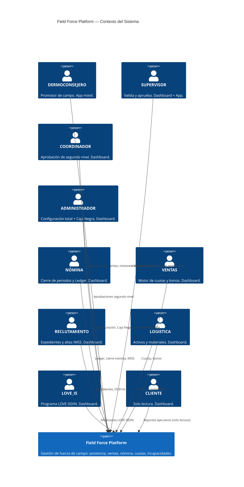

### Diagrama de Contenedores (C4 Nivel 2)

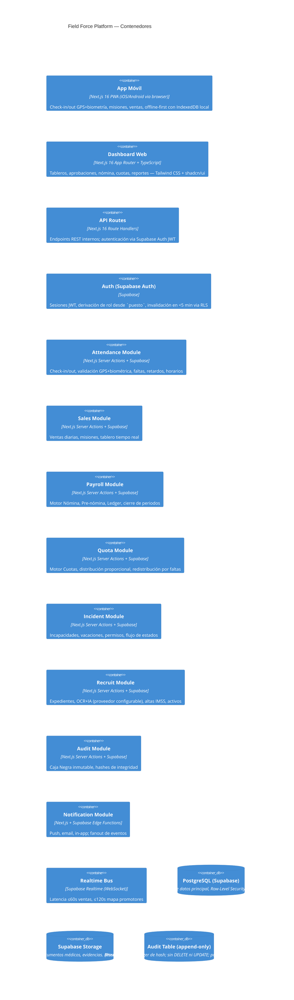

### Decisiones Arquitectónicas Clave

| Decisión | Elección | Justificación |
|---|---|---|
| App móvil | Next.js 16 PWA | Misma base de código que el dashboard; acceso nativo a cámara y GPS via Web APIs; sin app store |
| Dashboard web | Next.js 16 App Router + TypeScript | Feature-first, Server Components, Server Actions; optimizado para IA con Claude Code |
| UI | Tailwind CSS + shadcn/ui | Componentes accesibles, personalizables con tokens de marca be te ele |
| Base de datos | Supabase (PostgreSQL) | RLS nativo para multi-tenancy y RBAC; Realtime integrado; Auth incluido |
| Auth | Supabase Auth | JWT nativo, sesiones server-side, integración directa con RLS |
| Offline-first | IndexedDB (PWA) + sync queue | Promotores en zonas sin señal; sync ordenada por timestamp al reconectar |
| Tiempo real | Supabase Realtime (WebSocket) | Latencia ≤60s ventas, ≤120s mapa; sin polling; nativo en Supabase |
| Roles | Derivados de `puesto` en BD + RLS | Fuente única de verdad; cambio de rol propaga en ≤5 min via política RLS |
| Auditoría | Tabla append-only + SHA-256 | Inmutabilidad legal; detección de tampering |
| Biometría | AWS Rekognition / Azure Face API | Comparación selfie vs. foto de referencia con umbral configurable |
| Storage | Supabase Storage | Fotos de check-in, documentos médicos, evidencias; políticas de acceso por bucket |
| OCR+IA | Modelo de IA configurable (Codex, Gemini, Google Antigravity u otros) | Extracción de datos de expedientes y documentos médicos; el proveedor se configura via variable de entorno sin cambios de código |
| Arquitectura | Feature-First | Módulos autocontenidos optimizados para desarrollo asistido por IA |

---

## Logical Architecture — Functional Layers

El sistema se organiza en 6 capas funcionales que definen el flujo de información desde la estructura base hasta el análisis y gobierno. La médula espinal de toda la plataforma es:

> **PDV + Empleado + Asignación = operación diaria** → de esa operación diaria nacen asistencia + ventas + LOVE ISDIN + incidencias + reportes + nómina.

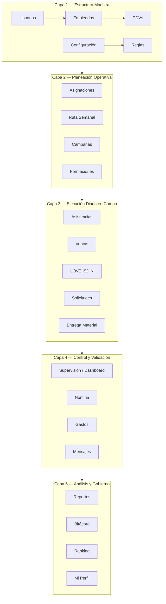

---

### Capa 1 — Estructura Maestra

Son los módulos que definen la base del sistema. Sin ellos, todo lo demás se cae. Son la columna vertebral.

| Módulo | Rol en la arquitectura |
|---|---|
| Usuarios | Define quién entra al sistema y con qué permisos |
| Empleados | Define quiénes son laboralmente; fuente de identidad |
| PDVs | Define dónde opera la gente; fuente de geocercas, horarios y supervisores |
| Configuración | Define catálogos, parámetros y opciones base del sistema |
| Reglas | Define validaciones automáticas y lógica de negocio irrompible |

**Relaciones clave:**
- `Usuarios` se alinea con `Empleados` pero no es lo mismo: Usuarios controla acceso, Empleados controla identidad laboral.
- `PDVs` es una entidad maestra que alimenta Asignaciones, Ruta Semanal, Asistencias, Campañas, Entrega de Material, LOVE ISDIN, Ventas y Supervisión.
- `Reglas` es el cerebro silencioso: define herencia de supervisor desde PDV, prioridad de horarios, flujos de aprobación, validaciones antifraude y visibilidad por rol.

---

### Capa 2 — Planeación Operativa

Define dónde, cuándo y cómo opera cada persona. La planeación siempre baja hacia la ejecución diaria. No debería existir nada diario que no nazca aquí.

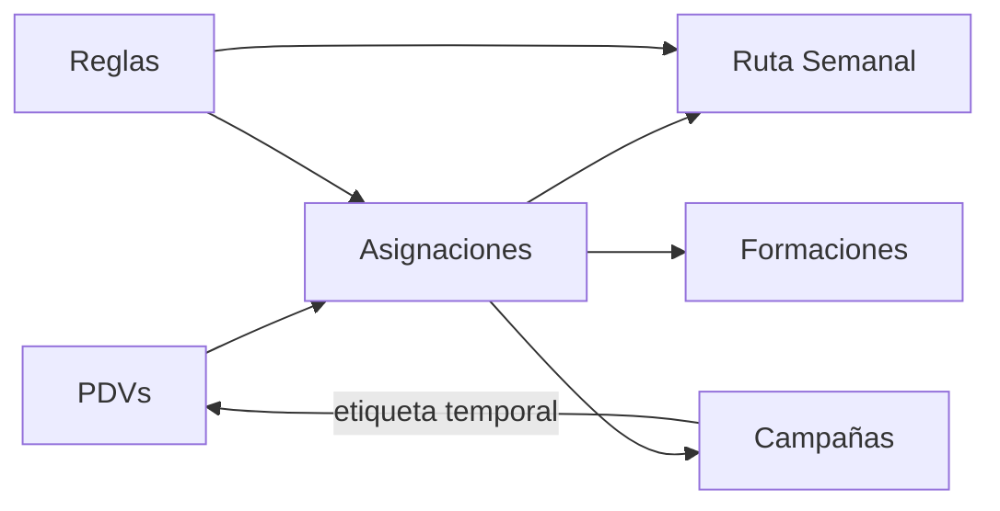

| Módulo | Función en la planeación |
|---|---|
| Asignaciones | Define quién va a qué PDV y cuándo; genera asignaciones diarias |
| Ruta Semanal | Organiza los recorridos del Supervisor por sus PDVs |
| Campañas | Agrega etiquetas temporales a PDVs específicos; no cambia la asignación base |
| Formaciones | Agrega eventos temporales que impactan gastos, operación y agendas |

---

### Capa 3 — Ejecución Diaria en Campo

Aquí es donde la operación realmente sucede. El flujo lógico es:

> Asignación diaria → Entrada → Jornada → Ventas / LOVE ISDIN / Incidencias / Campañas → Salida

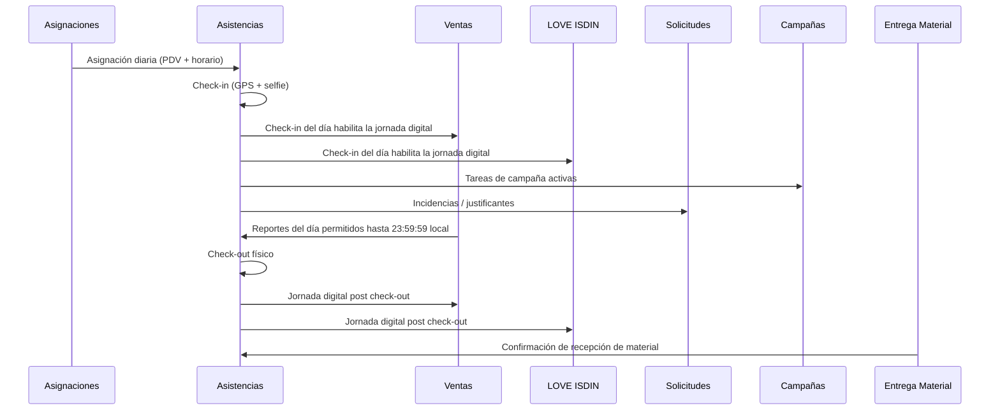

| Módulo | Fuente de datos | Destino de datos |
|---|---|---|
| Asistencias | Asignaciones, geocercas PDV, solicitudes justificadas | Dashboard, Supervisión, Nómina, Reportes |
| Ventas | Jornada activa, catálogo de productos, PDV | Reportes, Ranking, Campañas, Dashboard |
| LOVE ISDIN | DC, QR personal, asignación diaria, PDV, evidencia | Dashboard, Ranking, Supervisión, Reportes, Antifraude |
| Solicitudes | Empleados, roles, jerarquía operativa | Reclutamiento, Nómina, Supervisión, Expediente |
| Entrega Material | Empleados, PDVs, Supervisores, mes actual | Supervisión, Reportes, Evidencia de operación |

---

### Capa 4 — Control, Validación y Supervisión

Convierte la operación en gestión real. La supervisión no crea la realidad, la consume y valida.

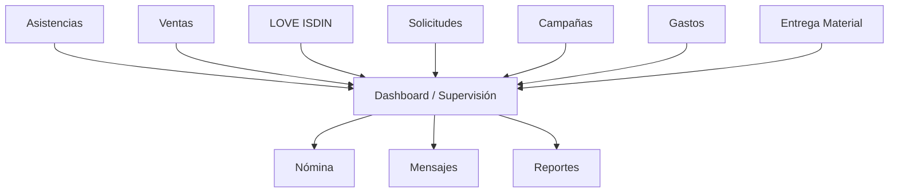

| Módulo | Función de control |
|---|---|
| Dashboard | Concentrador visual; consume todo, no es fuente primaria de datos |
| Nómina | Consume asistencia, incidencias formalizadas y ventas validadas para calcular pagos |
| Gastos | Captura, valida y aprueba gastos operativos; alimenta reportes financieros |
| Mensajes | Comunicación interna por grupos, zonas y roles; encuestas operativas |

---

### Capa 5 — Análisis, Auditoría y Gobierno

Aquí no se opera. Aquí se interpreta, audita y decide.

| Módulo | Función de gobierno |
|---|---|
| Reportes | Capa de salida analítica; consume ventas, asistencias, LOVE ISDIN, campañas, gastos, solicitudes, asignaciones, entrega de material y rankings |
| Bitácora | Consume eventos de todos los módulos críticos; trazabilidad inmutable; no genera operación |
| Ranking | Comparación de resultados de ventas y LOVE ISDIN; no captura datos |
| Mi Perfil | Información personal del usuario; no afecta lógica operativa mayor |

---

### Cadenas de Flujo Principal

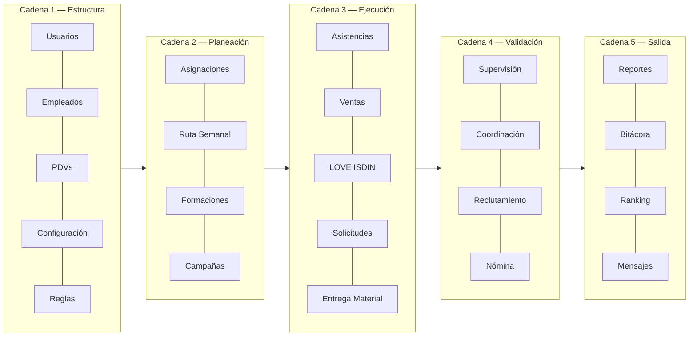

---

### Grupos de Navegación Visual

La interfaz agrupa los módulos en 4 secciones para reducir la carga cognitiva del usuario:

| Grupo | Módulos | Propósito |
|---|---|---|
| **Base** | Dashboard, PDVs, Empleados, Usuarios, Configuración, Reglas | Estructura y gobierno del sistema |
| **Operación** | Asignaciones, Ruta Semanal, Asistencias, Ventas, LOVE ISDIN, Campañas, Entrega Material | Ejecución y planeación del campo |
| **Administración** | Solicitudes, Nómina, Gastos, Formaciones | Ciclo de vida laboral y administrativo |
| **Control** | Reportes, Ranking, Mensajes, Bitácora, Mi Perfil | Análisis, comunicación y auditoría |

---

## Application Modules by Role

Esta sección describe los 22 módulos de la aplicación, su propósito y la matriz de acceso por rol. Los niveles de acceso utilizados son:

- **Sin acceso** — el módulo no es visible ni accesible para el rol.
- **Solo lectura** — puede consultar y exportar datos, sin modificar.
- **Lectura y escritura** — puede crear y editar registros propios o bajo su responsabilidad.
- **Gestión completa** — puede crear, editar, eliminar y administrar todos los registros del módulo.
- **Aprobación** — puede revisar y aprobar/rechazar solicitudes generadas por otros roles.

---

### Módulo 1: Dashboard

**Color de icono:** Morado/Púrpura

Panel principal con resumen general en tiempo real: ventas, LOVE ISDIN, asistencias, cumplimiento de metas, incidencias recientes, actividad de equipos.

| Rol | Acceso | Capacidades principales |
|---|---|---|
| DERMOCONSEJERO | Solo lectura | Ve su propio resumen: pre-nómina, ventas del día, misiones pendientes, progreso de cuota |
| SUPERVISOR | Solo lectura | Ve resumen de su equipo: estado de check-ins, ventas por PDV, alertas de cumplimiento |
| COORDINADOR | Solo lectura | Ve resumen consolidado de todos los supervisores y PDVs bajo su coordinación |
| RECLUTAMIENTO | Solo lectura | Ve indicadores de plantilla activa, bajas recientes, expedientes pendientes |
| NÓMINA | Solo lectura | Ve indicadores de pre-nómina, periodos abiertos, Ledger pendiente |
| LOGISTICA | Solo lectura | Ve indicadores de materiales pendientes de entrega y activos en campo |
| LOVE_IS | Solo lectura | Ve indicadores del programa LOVE ISDIN: afiliaciones del día, alertas de fraude |
| VENTAS | Solo lectura | Ve indicadores de ventas consolidadas, cumplimiento de cuotas, bonos proyectados |
| ADMINISTRADOR | Gestión completa | Ve todos los indicadores del sistema; puede configurar widgets y umbrales de alerta |
| CLIENTE | Solo lectura | Ve resumen ejecutivo de asistencia, coberturas y desempeño comercial por PDV y periodo |

---

### Módulo 2: PDVs (Puntos de Venta)

**Color de icono:** Azul claro/Celeste

Entidad maestra de los lugares físicos donde opera la dermoconsejera. Define la estructura geográfica y comercial del negocio. El dato nace desde operación, administración comercial o configuración inicial del sistema — cada PDV se registra una sola vez. Lo operan perfiles administrativos o de coordinación; la dermoconsejera nunca lo edita.

Se actualiza únicamente cuando cambia la estructura del PDV: alta o baja de tienda, cambio de supervisor asignado, ajuste de geocerca, cambio de ciudad/zona/cadena, o definición de reglas especiales de horario. No se toca como parte de la operación diaria.

**Campos clave:** nombre, cadena, ciudad, zona, supervisor asignado, geocerca (lat/lng + radio), tipo de PDV, estatus, reglas especiales de horario, campañas activas.

**Regla de herencia:** el supervisor pertenece al PDV, no directamente a la dermoconsejera. Cuando una DC es asignada a un PDV, hereda automáticamente el supervisor de ese PDV.

**Se relaciona con:** Asignaciones, Ruta Semanal, Asistencias, Ventas, LOVE ISDIN, Campañas, Entrega de Material, Ranking, Reportes.

**Impacta a:** dermoconsejeras (asignación y geocerca), supervisores (jerarquía y ruta), coordinación, reportes, campañas.

| Rol | Acceso | Capacidades principales |
|---|---|---|
| DERMOCONSEJERO | Sin acceso | — |
| SUPERVISOR | Solo lectura | Consulta los PDVs asignados a su zona: ubicación, horarios, radio de tolerancia |
| COORDINADOR | Solo lectura | Consulta todos los PDVs bajo su coordinación |
| RECLUTAMIENTO | Sin acceso | — |
| NÓMINA | Sin acceso | — |
| LOGISTICA | Solo lectura | Consulta PDVs para planificar entregas de materiales |
| LOVE_IS | Solo lectura | Consulta PDVs para monitorear cobertura del programa |
| VENTAS | Solo lectura | Consulta PDVs para configurar cuotas y asignaciones |
| ADMINISTRADOR | Gestión completa | Crea, edita y elimina PDVs; configura geocercas, horarios, cadena, zona y supervisor asignado |
| CLIENTE | Solo lectura | Consulta PDVs incluidos en sus reportes ejecutivos |

---

### Módulo 3: Empleados

**Color de icono:** Blanco con fondo Verde Esmeralda/Teal

Expediente laboral y administrativo de cada persona dentro del sistema. El dato nace desde RECLUTAMIENTO cuando se crea un nuevo empleado. Es la entidad de identidad laboral — distinta del Usuario, que es la identidad digital de acceso.

Se actualiza en eventos del ciclo de vida laboral: alta por expediente PDF con OCR, validación documental, formalización IMSS, vacaciones/incapacidades/permisos, baja y actualización de estatus. RECLUTAMIENTO crea el expediente y controla los datos laborales base; el análisis OCR+IA arranca inmediatamente al subir el PDF y precarga el formulario antes del guardado; NÓMINA formaliza IMSS, SBC diario y sueldo base; ADMINISTRADOR define supervisor, ID de nómina y crea el acceso provisional.

**Campos clave:** datos personales, puesto/rol, NSS, CURP, RFC, fecha de nacimiento, domicilio completo, código postal, teléfono celular, edad, años laborando, sexo, estado civil, originario, SBC diario, documentación, expediente digital, estatus laboral, fechas de alta y baja, documentos IMSS, usuario vinculado.

**Regla OCR para domicilio:** cuando el expediente incluya múltiples documentos, el sistema debe priorizar el `COMPROBANTE_DOMICILIO` (luz, agua, teléfono, internet, gas u otros servicios del hogar) por encima de la INE para poblar `domicilio_completo` y `codigo_postal`; la INE solo opera como fuente secundaria si no existe un comprobante legible.

**Regla central:** Empleado ≠ Usuario. Empleado es la identidad laboral y documental. Usuario es la cuenta de acceso. Están vinculados pero son entidades separadas.

**Se relaciona con:** Usuarios, Nómina, Solicitudes, Asignaciones, LOVE ISDIN, Entrega de Material, Ranking, Ventas, Asistencias.

**Impacta a:** todo el sistema, porque define quién es la persona que opera.

| Rol | Acceso | Capacidades principales |
|---|---|---|
| DERMOCONSEJERO | Solo lectura | Consulta su propio expediente y datos personales |
| SUPERVISOR | Solo lectura | Consulta expedientes de los DCs bajo su responsabilidad |
| COORDINADOR | Gestión parcial | Revisa candidatos enviados por Reclutamiento, confirma PDV objetivo e ISDINIZACIÓN, y devuelve el expediente al flujo de Reclutamiento para integración completa |
| RECLUTAMIENTO | Gestión completa | Crea candidatos por CV con OCR+IA; administra expedientes digitales, bajas y checklist; envía candidatos a Coordinación para validación del PDV objetivo, prepara el paquete operativo, envía expedientes a Nómina para alta IMSS y realiza la validación final antes de entregar a Administración |
| NÓMINA | Lectura y escritura | Recibe expedientes validados; registra sueldo base y comprobante IMSS; cierra el trámite para devolver el expediente a Reclutamiento y permitir su validación final antes del acceso |
| LOGISTICA | Solo lectura | Consulta datos de empleados para gestión de activos y recuperación en bajas |
| LOVE_IS | Sin acceso | — |
| VENTAS | Sin acceso | — |
| ADMINISTRADOR | Gestión completa | Acceso total; define supervisor e ID de nómina, crea usuarios y asigna roles; verifica expedientes |
| CLIENTE | Sin acceso | — |

---

### Módulo 4: Nómina

**Color de icono:** Verde

Transforma información laboral en cálculos de pago: pre-nómina en tiempo real, conceptos de pago/deducción, altas/bajas IMSS, cierre de periodos, Ledger de ajustes.

| Rol | Acceso | Capacidades principales |
|---|---|---|
| DERMOCONSEJERO | Solo lectura | Ve su pre-nómina acumulada desglosada: días trabajados, ventas, bonos, deducciones |
| SUPERVISOR | Solo lectura | Ve pre-nómina de los DCs bajo su responsabilidad |
| COORDINADOR | Solo lectura | Ve pre-nómina consolidada de su área |
| RECLUTAMIENTO | Sin acceso | — |
| NÓMINA | Gestión completa | Monitorea pre-nómina; configura conceptos de pago y deducción; cierra periodos; gestiona Ledger para ajustes post-cierre; registra altas/bajas IMSS |
| LOGISTICA | Sin acceso | — |
| LOVE_IS | Sin acceso | — |
| VENTAS | Solo lectura | Consulta cifras de bonos calculados para envío al módulo de nómina |
| ADMINISTRADOR | Gestión completa | Abre y cierra periodos; aprueba entradas de Ledger que superen el 30% del salario; acceso total de auditoría |
| CLIENTE | Sin acceso | — |

---

### Módulo 5: Asignaciones

**Color de icono:** Azul

Define qué dermoconsejera trabaja en qué PDV, en qué fechas y bajo qué condiciones. Es la base operativa diaria — sin asignación válida no existe jornada operativa completa. El dato nace desde el plan maestro de asignaciones y su réplica mensual.

Lo operan coordinación, administración operativa y supervisión en ciertos ajustes. Tiene varias capas de configuración: plan maestro base, plan mensual, ajustes mensuales, ajustes estructurales, parches especiales (ej. San Pablo), horarios especiales por PDV.

Se actualiza cada mes, por coberturas, cambios temporales o permanentes, y excepciones de horario.

**Campos clave:** dermoconsejera, PDV, supervisor heredado, días laborales, descansos, horario base, rango de vigencia, tipo (temporal/permanente), reglas especiales.

**Se relaciona con:** PDVs, Empleados, Ruta Semanal, Asistencias, Ventas, LOVE ISDIN, Campañas, Entrega de Material.

**Impacta a:** dermoconsejera (jornada diaria), supervisor (jerarquía), coordinación, reportes, asistencia, ventas, LOVE ISDIN.

| Rol | Acceso | Capacidades principales |
|---|---|---|
| DERMOCONSEJERO | Solo lectura | Consulta su asignación de PDV del día y del mes |
| SUPERVISOR | Lectura y escritura | Consulta asignaciones de su equipo; registra coberturas temporales (requieren aprobación de Administrador) |
| COORDINADOR | Aprobación | Aprueba cambios de tienda definitivos de un DC |
| RECLUTAMIENTO | Sin acceso | — |
| NÓMINA | Sin acceso | — |
| LOGISTICA | Sin acceso | — |
| LOVE_IS | Sin acceso | — |
| VENTAS | Solo lectura | Consulta asignaciones para configurar distribución de cuotas |
| ADMINISTRADOR | Gestión completa | Crea y modifica el plan maestro mensual; aprueba coberturas; verifica asignaciones diarias por DC |
| CLIENTE | Sin acceso | — |

---

### Módulo 6: Campañas

**Color de icono:** Naranja/Coral

Capa temporal que etiqueta PDVs con condiciones comerciales especiales durante un periodo. No cambia la asignación base — solo etiqueta temporalmente el PDV y habilita información adicional, metas extra, evidencias específicas y reportes diferenciados. El dato nace desde operación comercial, marketing o coordinación.

Lo operan administración, coordinación y perfiles de operación comercial. Se crea con: nombre, rango de fechas, PDVs participantes, productos foco, cuotas adicionales e instrucciones de mercadeo.

**Campos clave:** nombre, cadena, fechas de inicio/fin, PDVs incluidos, productos foco, cuota adicional, instrucciones, evidencias requeridas.

**Se relaciona con:** PDVs, Asignaciones, Ventas, Supervisión, Reportes.

**Impacta a:** dermoconsejera (tareas adicionales en visita), supervisor (monitoreo de evidencias), operación comercial, reportes, ventas.

| Rol | Acceso | Capacidades principales |
|---|---|---|
| DERMOCONSEJERO | Solo lectura | Ve las campañas activas en sus PDVs asignados; ejecuta tareas de campaña durante visitas |
| SUPERVISOR | Solo lectura | Consulta campañas activas en su zona; monitorea cumplimiento de evidencias |
| COORDINADOR | Solo lectura | Consulta campañas de toda su área |
| RECLUTAMIENTO | Sin acceso | — |
| NÓMINA | Sin acceso | — |
| LOGISTICA | Solo lectura | Consulta campañas para coordinar entrega de materiales promocionales |
| LOVE_IS | Sin acceso | — |
| VENTAS | Gestión completa | Crea y administra campañas; define tiendas participantes, productos foco, cuotas adicionales y requerimientos de evidencia |
| ADMINISTRADOR | Gestión completa | Acceso total; puede crear, editar y eliminar cualquier campaña |
| CLIENTE | Solo lectura | Consulta campañas activas y resultados de cumplimiento en sus PDVs |

---

### Módulo 7: Entrega de Material

**Color de icono:** Gris azulado

Controla la evidencia de entrega de material mensual a la dermoconsejera. El dato nace desde la operación mensual de supervisión cuando el supervisor entrega material en campo. Lo opera principalmente el supervisor; coordinación y administración consultan.

Se crea un registro por mes y por entrega. Exige foto tomada desde cámara (sin galería) con sello de fecha/hora/PDV, acuses de recibo y trazabilidad mensual. Puede observarse, validarse o corregirse.

**Campos clave:** supervisor, dermoconsejera, PDV, mes, foto de entrega, acuses, fecha y hora, estado.

**Se relaciona con:** PDVs, Empleados, Supervisión, Reportes.

**Impacta a:** supervisor (evidencia de operación), dermoconsejera, coordinación, reportes de operación.

| Rol | Acceso | Capacidades principales |
|---|---|---|
| DERMOCONSEJERO | Solo lectura | Consulta materiales recibidos en su PDV |
| SUPERVISOR | Lectura y escritura | Registra entregas de materiales en sus PDVs; captura evidencia fotográfica y acuses de recibo |
| COORDINADOR | Solo lectura | Monitorea estado de entregas en su área |
| RECLUTAMIENTO | Sin acceso | — |
| NÓMINA | Sin acceso | — |
| LOGISTICA | Gestión completa | Administra el catálogo de materiales; planifica y registra envíos; verifica confirmaciones de recepción; gestiona activos prestados (tablets, uniformes, gafetes); recibe notificaciones de baja para recuperación de activos |
| LOVE_IS | Sin acceso | — |
| VENTAS | Sin acceso | — |
| ADMINISTRADOR | Solo lectura | Consulta estado general de entregas y activos en campo |
| CLIENTE | Sin acceso | — |

---

### Módulo 8: Gastos

**Color de icono:** Morado claro/Lavanda

Módulo transversal para registrar y controlar gastos operativos relacionados con rutas, formaciones, viajes, campañas y actividades operativas. El dato nace cuando un usuario autorizado registra un gasto. La dermoconsejera no registra gastos.

Flujo de estados: borrador → envío → revisión → aprobación/rechazo. Tiene catálogo de conceptos, flujo de aprobación jerárquico y archivos adjuntos como comprobante.

**Campos clave:** concepto, monto, evidencia/comprobante, usuario, rol, evento relacionado (formación/campaña/ruta), estado, historial de revisión.

**Se relaciona con:** Formaciones, Campañas, Ruta Semanal, Reportes, Usuarios, Empleados.

**Impacta a:** operación administrativa, finanzas, supervisión, reportes.

| Rol | Acceso | Capacidades principales |
|---|---|---|
| DERMOCONSEJERO | Sin acceso | — |
| SUPERVISOR | Lectura y escritura | Registra sus propios gastos; revisa y aprueba gastos de los DCs bajo su responsabilidad |
| COORDINADOR | Aprobación | Aprueba gastos de supervisores; consulta reportes de gastos de su área |
| RECLUTAMIENTO | Sin acceso | — |
| NÓMINA | Solo lectura | Consulta gastos aprobados para integración con cálculos de nómina |
| LOGISTICA | Sin acceso | — |
| LOVE_IS | Sin acceso | — |
| VENTAS | Sin acceso | — |
| ADMINISTRADOR | Gestión completa | Configura catálogos de tipos de gasto y límites; acceso total a reportes financieros |
| CLIENTE | Sin acceso | — |

---

### Módulo 9: Formaciones

**Color de icono:** Amarillo/Dorado

Administra capacitaciones y eventos formativos. El dato nace desde el calendario oficial de formaciones. Lo operan administración, coordinación y perfiles autorizados de formación. Se implementa como catálogo de eventos que luego puede usarse en gastos y reportes.

Se actualiza cargando eventos, importando calendario, ajustando sedes o fechas, activando o cancelando eventos.

**Campos clave:** evento, sede, fecha, ciudad, responsable, participantes, estado.

**Se relaciona con:** Gastos, Reportes, Usuarios/Empleados, eventos relacionados.

**Impacta a:** operación, coordinación, gastos, reportes.

| Rol | Acceso | Capacidades principales |
|---|---|---|
| DERMOCONSEJERO | Solo lectura | Consulta formaciones programadas para su equipo; confirma asistencia |
| SUPERVISOR | Lectura y escritura | Programa formaciones para su equipo; registra asistencia; vincula gastos de formación |
| COORDINADOR | Lectura y escritura | Programa formaciones para supervisores; aprueba calendario de formaciones de su área |
| RECLUTAMIENTO | Lectura y escritura | Programa formaciones de inducción para nuevos empleados; registra asistencia |
| NÓMINA | Sin acceso | — |
| LOGISTICA | Sin acceso | — |
| LOVE_IS | Lectura y escritura | Programa formaciones del programa LOVE ISDIN; registra asistencia de DCs |
| VENTAS | Lectura y escritura | Programa formaciones comerciales; registra asistencia |
| ADMINISTRADOR | Gestión completa | Acceso total; configura catálogo de tipos de formación |
| CLIENTE | Sin acceso | — |

---

### Módulo 10: Ruta Semanal

**Color de icono:** Turquesa/Aqua

Planeación semanal de visitas del supervisor a sus PDVs. El dato nace de los PDVs asignados al supervisor y sus obligaciones de visita. El supervisor arma su semana, distribuye tiendas por día y ajusta por eventualidades. Coordinación revisa, aprueba y da seguimiento. Se implementa como módulo de planeación semanal y control de cumplimiento.

**Campos clave:** supervisor, tiendas, días, mapa/secuencia, estatus, ajustes.

**Se relaciona con:** PDVs, Asignaciones, Reportes, cuotas de visita.

**Impacta a:** supervisor, coordinación, operación, cumplimiento de visitas.

| Rol | Acceso | Capacidades principales |
|---|---|---|
| DERMOCONSEJERO | Sin acceso | — |
| SUPERVISOR | Lectura y escritura | Planifica su ruta semanal de visitas a PDVs; registra visita con selfie obligatoria y checklist de calidad |
| COORDINADOR | Aprobación | Revisa y aprueba o rechaza rutas semanales de supervisores; consulta historial de visitas |
| RECLUTAMIENTO | Sin acceso | — |
| NÓMINA | Sin acceso | — |
| LOGISTICA | Sin acceso | — |
| LOVE_IS | Sin acceso | — |
| VENTAS | Sin acceso | — |
| ADMINISTRADOR | Solo lectura | Consulta rutas y visitas para auditoría |
| CLIENTE | Sin acceso | — |

---

### Módulo 11: Asistencias

**Color de icono:** Verde claro

Registro formal de presencia operativa del día. El dato nace de la asignación diaria, el registro de entrada/salida, la geocerca, y las incidencias justificadas. No debe reescribirse arbitrariamente — las correcciones siguen flujo formal. Se implementa como resultado de la jornada operativa diaria, no como captura manual libre.

**Campos clave:** fecha, empleado, PDV, hora entrada, hora salida, geocerca, estatus, incidencias, justificaciones.

**Se relaciona con:** Asignaciones, Solicitudes, Jornada DC, Nómina, Dashboard, Reportes.

**Impacta a:** dermoconsejera, supervisor, RH, Nómina, reportes.

| Rol | Acceso | Capacidades principales |
|---|---|---|
| DERMOCONSEJERO | Lectura y escritura | Ejecuta check-in y check-out con GPS y selfie; ve su historial de asistencia, retardos y faltas |
| SUPERVISOR | Aprobación | Valida o rechaza excepciones de asistencia; aprueba check-ins en PENDIENTE_VALIDACION; consulta asistencia de su equipo |
| COORDINADOR | Solo lectura | Consulta asistencia consolidada de su área; aprueba anulación de faltas administrativas |
| RECLUTAMIENTO | Sin acceso | — |
| NÓMINA | Solo lectura | Consulta registros de asistencia para cálculo de nómina; recibe alertas de faltas administrativas |
| LOGISTICA | Sin acceso | — |
| LOVE_IS | Sin acceso | — |
| VENTAS | Sin acceso | — |
| ADMINISTRADOR | Gestión completa | Configura calendarios laborales, horarios, días feriados y reglas de retardo; acceso total a registros |
| CLIENTE | Solo lectura | Consulta reportes de asistencia y coberturas de sus PDVs |

---

### Módulo 12: Solicitudes

**Color de icono:** Naranja

Motor de flujos de aprobación y formalización de solicitudes laborales y operativas. El dato nace cuando un usuario inicia una solicitud o incidencia: vacaciones, incapacidades, cumpleaños, justificantes, incidencias. Cada tipo de solicitud tiene su jerarquía de aprobación.

**Campos clave:** tipo, fechas, motivo, evidencia, estado, historial, comentarios.

**Se relaciona con:** Empleados, Asistencias, Reclutamiento, Nómina, Supervisión, Expediente.

**Impacta a:** empleado, supervisor, RH, Nómina, asistencia.

| Rol | Acceso | Capacidades principales |
|---|---|---|
| DERMOCONSEJERO | Lectura y escritura | Crea solicitudes de vacaciones, incapacidades, permisos y cumpleaños; adjunta documentos médicos (sin galería); consulta estado de sus solicitudes |
| SUPERVISOR | Aprobación | Aprueba o rechaza solicitudes de primer nivel de sus DCs en ≤24h; recibe notificaciones de nuevas solicitudes |
| COORDINADOR | Aprobación | Aprueba definitivamente vacaciones, cambios de tienda e incidencias graves no resueltas por Supervisor |
| RECLUTAMIENTO | Lectura y escritura | Formaliza en el sistema incidencias autorizadas por operación; gestiona bajas con checklist |
| NÓMINA | Aprobación | Formaliza incapacidades en estado VALIDADA_SUP cambiando a REGISTRADA_RH en ≤48h |
| LOGISTICA | Sin acceso | — |
| LOVE_IS | Sin acceso | — |
| VENTAS | Sin acceso | — |
| ADMINISTRADOR | Gestión completa | Configura catálogo de tipos de solicitud y reglas de anticipación; acceso total |
| CLIENTE | Sin acceso | — |

---

### Módulo 13: Reportes

**Color de icono:** Azul

Informes operativos y administrativos: ventas, asistencias, campañas, gastos, desempeño, cumplimiento de metas. Filtros por periodo, zona, supervisor, PDV.

| Rol | Acceso | Capacidades principales |
|---|---|---|
| DERMOCONSEJERO | Solo lectura | Consulta sus propios reportes de ventas, asistencia y progreso de cuota |
| SUPERVISOR | Solo lectura | Consulta reportes de su equipo y PDVs; exporta CSV de asistencia y ventas |
| COORDINADOR | Solo lectura | Consulta reportes consolidados de su área; filtra por zona, supervisor y PDV |
| RECLUTAMIENTO | Solo lectura | Consulta reportes de plantilla, rotación y expedientes |
| NÓMINA | Solo lectura | Consulta reportes de nómina, Ledger y conceptos de pago/deducción; exporta CSV/XLSX |
| LOGISTICA | Solo lectura | Consulta reportes de entregas de materiales y activos en campo |
| LOVE_IS | Solo lectura | Consulta reportes y métricas del programa LOVE ISDIN: afiliaciones, fraudes, cumplimiento de metas |
| VENTAS | Solo lectura | Consulta reportes de ventas consolidadas, cuotas y bonos; exporta datos para nómina |
| ADMINISTRADOR | Gestión completa | Acceso a todos los reportes; configura plantillas y exportaciones; genera reporte de nómina definitivo |
| CLIENTE | Solo lectura | Accede a reportes ejecutivos consolidados de asistencia, coberturas, evidencias fotográficas y desempeño comercial |

---

### Módulo 14: Mensajes

**Color de icono:** Celeste

Comunicación interna: comunicados a grupos, anuncios operativos, encuestas internas.

| Rol | Acceso | Capacidades principales |
|---|---|---|
| DERMOCONSEJERO | Solo lectura | Recibe comunicados y anuncios; responde encuestas internas |
| SUPERVISOR | Lectura y escritura | Envía comunicados a su equipo de DCs; recibe anuncios de coordinación |
| COORDINADOR | Lectura y escritura | Envía comunicados a supervisores y equipos de su área |
| RECLUTAMIENTO | Lectura y escritura | Envía comunicados relacionados con procesos de incorporación y bajas |
| NÓMINA | Lectura y escritura | Envía comunicados de cierre de periodo y recordatorios de nómina |
| LOGISTICA | Lectura y escritura | Envía comunicados de entrega de materiales y recuperación de activos |
| LOVE_IS | Lectura y escritura | Envía comunicados del programa LOVE ISDIN a DCs y supervisores |
| VENTAS | Lectura y escritura | Envía comunicados de campañas, cuotas y resultados comerciales |
| ADMINISTRADOR | Gestión completa | Envía comunicados a cualquier grupo; administra canales y encuestas |
| CLIENTE | Sin acceso | — |

---

### Módulo 15: Mi Perfil

**Color de icono:** Morado/Violeta

Información personal del usuario: datos de perfil, actualización de información básica, actividad en el sistema.

| Rol | Acceso | Capacidades principales |
|---|---|---|
| DERMOCONSEJERO | Lectura y escritura | Consulta y actualiza su información básica de perfil; ve su actividad reciente en el sistema |
| SUPERVISOR | Lectura y escritura | Consulta y actualiza su información básica de perfil; ve su actividad reciente |
| COORDINADOR | Lectura y escritura | Consulta y actualiza su información básica de perfil; ve su actividad reciente |
| RECLUTAMIENTO | Lectura y escritura | Consulta y actualiza su información básica de perfil |
| NÓMINA | Lectura y escritura | Consulta y actualiza su información básica de perfil |
| LOGISTICA | Lectura y escritura | Consulta y actualiza su información básica de perfil |
| LOVE_IS | Lectura y escritura | Consulta y actualiza su información básica de perfil |
| VENTAS | Lectura y escritura | Consulta y actualiza su información básica de perfil |
| ADMINISTRADOR | Lectura y escritura | Consulta y actualiza su información básica de perfil |
| CLIENTE | Lectura y escritura | Consulta y actualiza su información básica de perfil |

---

### Módulo 16: Configuración

**Color de icono:** Gris

Parámetros generales: catálogos, opciones globales, integraciones, ajustes del sistema. Solo ADMINISTRADOR.

| Rol | Acceso | Capacidades principales |
|---|---|---|
| DERMOCONSEJERO | Sin acceso | — |
| SUPERVISOR | Sin acceso | — |
| COORDINADOR | Sin acceso | — |
| RECLUTAMIENTO | Sin acceso | — |
| NÓMINA | Sin acceso | — |
| LOGISTICA | Sin acceso | — |
| LOVE_IS | Sin acceso | — |
| VENTAS | Sin acceso | — |
| ADMINISTRADOR | Gestión completa | Configura catálogos (productos, cadenas, zonas, tipos de incidencia), parámetros globales del sistema, integraciones externas, umbrales de alerta y reglas de cálculo |
| CLIENTE | Sin acceso | — |

---

### Módulo 17: Reglas

**Color de icono:** Rojo/Guinda

Reglas de negocio y validaciones automáticas: políticas de asistencia, control antifraude, límites operativos, validaciones de datos, y motor de validación de asignaciones (ERROREs, ALERTAs, AVISOs y alertas de operación en vivo). Solo ADMINISTRADOR.

| Rol | Acceso | Capacidades principales |
|---|---|---|
| DERMOCONSEJERO | Sin acceso | — |
| SUPERVISOR | Sin acceso | — |
| COORDINADOR | Sin acceso | — |
| RECLUTAMIENTO | Sin acceso | — |
| NÓMINA | Sin acceso | — |
| LOGISTICA | Sin acceso | — |
| LOVE_IS | Sin acceso | — |
| VENTAS | Sin acceso | — |
| ADMINISTRADOR | Gestión completa | Define y modifica reglas de negocio: políticas de asistencia (tolerancias, retardos), umbrales biométricos y GPS, reglas antifraude, límites de Ledger, jerarquía de horarios, reglas de cuotas; configura umbrales del motor de validación de asignaciones (tiempo de tolerancia para alerta de check-in, umbral de retardos masivos, tiempo máximo de cola offline) |
| CLIENTE | Sin acceso | — |

---

### Módulo 18: Bitácora

**Color de icono:** Marrón/Café

Historial de auditoría: todas las acciones relevantes, cambios, movimientos, decisiones. Solo ADMINISTRADOR (Caja Negra).

| Rol | Acceso | Capacidades principales |
|---|---|---|
| DERMOCONSEJERO | Sin acceso | — |
| SUPERVISOR | Sin acceso | — |
| COORDINADOR | Sin acceso | — |
| RECLUTAMIENTO | Sin acceso | — |
| NÓMINA | Sin acceso | — |
| LOGISTICA | Sin acceso | — |
| LOVE_IS | Sin acceso | — |
| VENTAS | Sin acceso | — |
| ADMINISTRADOR | Solo lectura | Consulta el log de auditoría inmutable; filtra por usuario, tipo de acción, entidad y rango de fechas; recibe alertas de entradas comprometidas (hash inválido) |
| CLIENTE | Sin acceso | — |

---

### Módulo 19: Usuarios

**Color de icono:** Morado/Violeta

Módulo de cuentas de acceso al sistema. El dato nace al crear el vínculo entre el empleado y su cuenta de acceso. Separado de Empleados pero vinculado a ellos: Empleado = identidad laboral, Usuario = identidad digital de acceso.

Se actualiza cuando: se crea acceso (alta de empleado), se activa primer login, se registra correo verificado, se cambia contraseña, se bloquea o reactiva la cuenta.

**Campos clave:** username o acceso temporal, correo, estado de activación (PROVISIONAL / PENDIENTE_VERIFICACION_EMAIL / ACTIVA), rol derivado de `puesto`, permisos, vínculo a empleado, vínculo a cuenta de cliente (obligatorio para usuarios con rol CLIENTE).

**Se relaciona con:** Empleados, Login/Auth, Mensajes, permisos por módulo, seguridad, Cuentas de Cliente.

**Impacta a:** todos los usuarios del sistema.

| Rol | Acceso | Capacidades principales |
|---|---|---|
| DERMOCONSEJERO | Sin acceso | — |
| SUPERVISOR | Sin acceso | — |
| COORDINADOR | Sin acceso | — |
| RECLUTAMIENTO | Sin acceso | — |
| NÓMINA | Sin acceso | — |
| LOGISTICA | Sin acceso | — |
| LOVE_IS | Sin acceso | — |
| VENTAS | Sin acceso | — |
| ADMINISTRADOR | Gestión completa | Crea y desactiva cuentas de usuario; asigna y modifica el campo `puesto` que deriva el rol; vincula usuarios CLIENTE a su cuenta de cliente correspondiente; controla módulos accesibles; fuerza invalidación de sesiones activas |
| CLIENTE | Sin acceso | — |

---

### Módulo 20: Ranking

**Color de icono:** Naranja oscuro

Módulo comparativo de desempeño. Nadie lo "captura" — se actualiza automáticamente conforme entran datos operativos. Es capa de lectura y comparación, nunca fuente primaria de datos. El dato nace de datos agregados de Ventas, LOVE ISDIN, campañas y metas.

**Campos clave:** posiciones, puntajes, filtros, comparativos por periodo, zona, equipo.

**Se relaciona con:** Ventas, LOVE ISDIN, Campañas, Reportes.

**Impacta a:** supervisión, operación, motivación comercial, análisis.

| Rol | Acceso | Capacidades principales |
|---|---|---|
| DERMOCONSEJERO | Solo lectura | Ve su posición en el ranking de ventas y LOVE ISDIN respecto a sus compañeros |
| SUPERVISOR | Solo lectura | Ve el ranking de los DCs de su equipo y su posición como supervisor |
| COORDINADOR | Solo lectura | Ve el ranking consolidado de supervisores y DCs de su área |
| RECLUTAMIENTO | Sin acceso | — |
| NÓMINA | Sin acceso | — |
| LOGISTICA | Sin acceso | — |
| LOVE_IS | Solo lectura | Ve el ranking de DCs por afiliaciones LOVE ISDIN |
| VENTAS | Solo lectura | Ve el ranking de DCs y equipos por ventas y cumplimiento de cuotas |
| ADMINISTRADOR | Solo lectura | Ve todos los rankings del sistema |
| CLIENTE | Solo lectura | Ve el ranking de desempeño de PDVs y equipos en sus cuentas |

---

### Módulo 21: Ventas

**Color de icono:** Verde

Registro de productos vendidos por la dermoconsejera durante el día operativo. El dato nace desde la captura operativa de la DC con check-in válido del mismo día. La salida física del PDV no bloquea el reporte: después del check-out, la jornada digital permanece abierta hasta las 23:59:59 de la zona horaria local del estado del PDV.

**Campos clave:** empleado, PDV, producto, cantidad, fecha_operativa, fecha_registro, metodo_ingreso, gap de retraso, jornada digital.

**Se relaciona con:** Asignación, Jornada, Campañas, Ranking, Reportes.

**Impacta a:** dermoconsejera, supervisor, coordinación, reportes, campañas.

| Rol | Acceso | Capacidades principales |
|---|---|---|
| DERMOCONSEJERO | Lectura y escritura | Registra ventas diarias con check-in válido del mismo día; puede completarlas después del check-out físico hasta el cierre local; ve su historial de ventas |
| SUPERVISOR | Aprobación | Valida o rechaza ventas capturadas por sus DCs; consulta ventas de su equipo por PDV y periodo |
| COORDINADOR | Solo lectura | Consulta ventas consolidadas de su área |
| RECLUTAMIENTO | Sin acceso | — |
| NÓMINA | Solo lectura | Consulta ventas confirmadas para cálculo de bonos en nómina |
| LOGISTICA | Sin acceso | — |
| LOVE_IS | Sin acceso | — |
| VENTAS | Gestión completa | Consolida ventas reportadas y validadas; configura motor de distribución de cuota individual; calcula porcentaje de cumplimiento y bonos al cierre de mes; envía cifras al módulo de Nómina |
| ADMINISTRADOR | Solo lectura | Consulta ventas para auditoría y configuración de productos |
| CLIENTE | Solo lectura | Consulta ventas y desempeño comercial de sus PDVs |

---

### Módulo 22: LOVE ISDIN

**Color de icono:** Rosa/Fucsia

Flujo de control interno del programa LOVE ISDIN. La app documenta la evidencia de registros exitosos hechos en la plataforma externa de loyalty — no es la plataforma loyalty misma. El dato nace cuando la dermoconsejera logra un alta real en LOVE ISDIN y luego captura la evidencia en esta app.

Se actualiza por cada registro exitoso con: correo del cliente, ticket, pantalla de éxito, fecha/hora, QR oficial de la dermoconsejera y PDV real del día operativo. El QR identifica a la dermoconsejera; la afiliación cuenta analíticamente para el PDV donde se realizó. También incluye revisión de excepciones, alertas antifraude y monitoreo de metas.

**Campos clave:** QR oficial asignado a la DC, PDV, fecha_operativa, fecha_registro, metodo_ingreso, jornada digital, avance diario, cuota mensual, evidencias, excepciones, alertas.

**Se relaciona con:** Empleados, Asignaciones, PDVs, Ranking, Dashboard, Reportes.

**Impacta a:** dermoconsejera, supervisor, admins LOVE ISDIN, reportes comerciales.

| Rol | Acceso | Capacidades principales |
|---|---|---|
| DERMOCONSEJERO | Lectura y escritura | Registra afiliaciones de clientes al programa LOVE ISDIN con check-in válido del mismo día; puede completarlas después del check-out físico hasta el cierre local; ve su progreso de metas de afiliación |
| SUPERVISOR | Solo lectura | Monitorea afiliaciones de sus DCs; recibe alertas de posibles fraudes en su equipo |
| COORDINADOR | Solo lectura | Consulta métricas del programa en su área |
| RECLUTAMIENTO | Sin acceso | — |
| NÓMINA | Sin acceso | — |
| LOGISTICA | Sin acceso | — |
| LOVE_IS | Gestión completa | Supervisa afiliaciones en tiempo real; administra asignación de QR personales; monitorea metas diarias y cuotas mensuales; opera bandeja de control antifraude; gestiona excepciones de afiliaciones observadas; consulta reportes y métricas del programa |
| VENTAS | Sin acceso | — |
| ADMINISTRADOR | Solo lectura | Consulta métricas del programa para auditoría; configura parámetros del programa |
| CLIENTE | Solo lectura | Consulta métricas de afiliación LOVE ISDIN en sus PDVs |

---

## Components and Interfaces

### Attendance Service (módulo crítico — Low-Level Design)

Responsable de: check-in/out, validación GPS+biométrica, cálculo de faltas/retardos, jerarquía de horarios, regla 3 retardos = 1 falta administrativa.

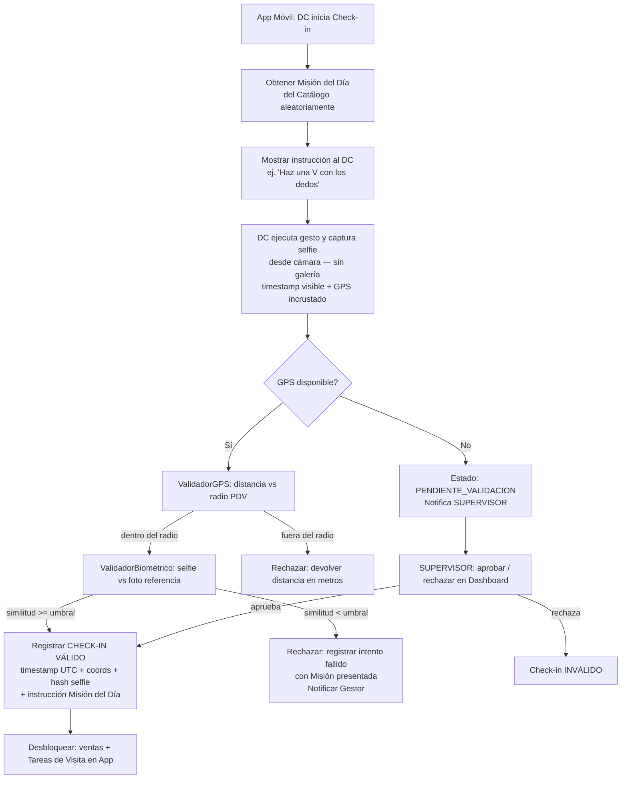

**Jerarquía de Horarios (6 niveles)**

```typescript
// Resolución de horario — orden de prioridad descendente
type ScheduleLevel =
  | 'PUNTUAL_EVENTO'        // 1. Asignación puntual / evento especial del día
  | 'SEGMENTO_RUTA'         // 2. Horario de segmento de ruta
  | 'EXCEPCION_TIENDA_FECHA'// 3. Excepción de tienda por fecha específica
  | 'CADENA_DIA_SEMANA'     // 4. Horario por cadena y día de la semana
  | 'HORARIO_ESTANDAR_CADENA'// 5. Horario estándar de la cadena
  | 'GLOBAL_AGENCIA';       // 6. Horario global de la agencia

function resolveSchedule(dcId: string, date: Date): ScheduleSnapshot {
  for (const level of SCHEDULE_LEVELS) {
    const schedule = lookupSchedule(dcId, date, level);
    if (schedule) return snapshot(schedule, level); // inmutable al momento del check-in
  }
  throw new Error('No schedule configured');
}
```

**Caso especial San Pablo**: el horario se resuelve por bloque semanal configurado por el Administrador. Si no existe configuración para la semana actual, se aplica el horario de cadena/global y se genera alerta al SUPERVISOR. Cambios a mitad de semana solo aplican a días futuros.

**Regla 3 Retardos = 1 Falta Administrativa**

```
contador_retardos[dc_id][mes] += 1
IF contador == 3:
  → generar FaltaAdministrativa(fecha=hoy)
  → Motor_Nomina.aplicarDescuento(dc_id, 1_dia_salario)
  → notificar(SUPERVISOR, NOMINA)
  → para anular: requiere aprobación COORDINADOR
```

### Payroll Service — Motor de Nómina (Low-Level Design)

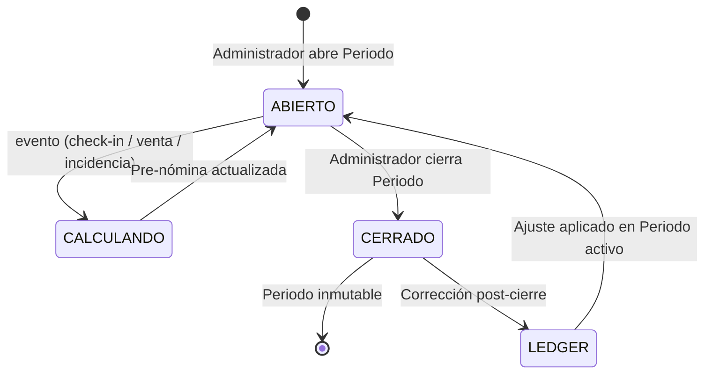

**Fórmula de Pre-nómina**

```
pre_nomina = (dias_trabajados × salario_base_diario)
           + (ventas_confirmadas × porcentaje_bono IF cumple_cuota)
           - (faltas × deduccion_por_falta)
           + SUM(ledger_entries WHERE periodo = activo AND dc = dc_id)
```

**Ledger de doble entrada**

- Cada entrada referencia: `dc_id`, `periodo_origen`, `periodo_aplicacion`, `monto`, `concepto`, `creado_por`, `timestamp_utc`.
- Si `|monto| > 0.30 × salario_base_mensual` → requiere segunda aprobación de ADMINISTRADOR distinto.
- Periodo cerrado es inmutable: ningún UPDATE/DELETE sobre sus registros.

**Flujo de Incapacidades**

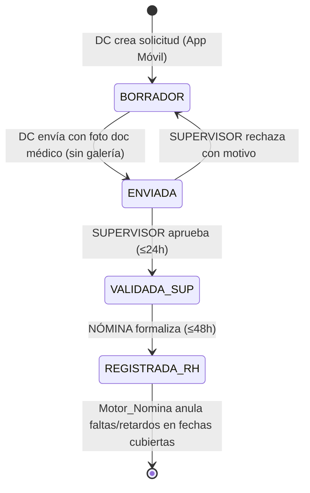

**Lógica de pago de incapacidad por bloque continuo**

```
bloque_continuo = días consecutivos sin Asistencia Normal entre folios
días 1-3 del bloque → IP/ISP (pagado al 100% sueldo base)
día 4+ del bloque   → I/IS (justificado, sin pago empresa)

IF nuevo_folio SIN asistencia_normal_entre_folios AND folio_anterior.agotó_3_días:
  → todos los días del nuevo folio = IS (sin pago)

WHEN asistencia_normal_registrada:
  → reiniciar contador de días pagados
```

### Quota Service — Motor de Cuotas (Low-Level Design)

**Invariante central (Req 12.31):** `SUM(cuotas_individuales[pdv][periodo]) == cuota_total[pdv][periodo]` en todo momento.

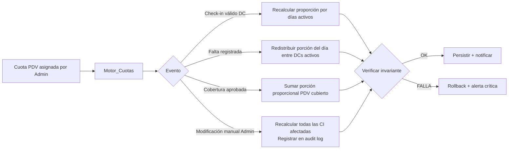

**Cuota Individual proporcional**

```
CI(dc, pdv, periodo) = cuota_pdv × (dias_activos_dc_en_pdv / dias_laborables_pdv_en_periodo)
```

Cuota de SUPERVISOR = `SUM(cuota_pdv)` de todos sus PDVs asignados en el periodo.

### Supabase Auth — Derivación de Roles

```typescript
// Rol derivado de `puesto` — sin campo separado
// Implementado como custom claim en el JWT de Supabase Auth
// Se actualiza via Database Webhook cuando cambia el campo `puesto` en la tabla empleados

const ROLE_MAP: Record<string, Role> = {
  'DERMOCONSEJERO': Role.DC,
  'SUPERVISOR': Role.SUPERVISOR,
  'COORDINADOR': Role.COORDINADOR,
  'RECLUTAMIENTO': Role.RECLUTAMIENTO,
  'NÓMINA': Role.NOMINA,
  'LOGISTICA': Role.LOGISTICA,
  'LOVE_IS': Role.LOVE_IS,
  'VENTAS': Role.VENTAS,
  'ADMINISTRADOR': Role.ADMIN,
  'CLIENTE': Role.CLIENTE,
};

// Cambio de puesto → invalidar sesión en ≤5 min
// Implementado con Supabase Database Webhook → Edge Function que revoca el JWT activo
```

Row-Level Security en PostgreSQL garantiza que cada rol solo accede a sus propios datos sin lógica adicional en la aplicación. Para usuarios con rol CLIENTE, la política RLS filtra adicionalmente por `cuenta_cliente_id`, de forma que ninguna consulta pueda retornar datos de PDVs no asignados a su cuenta, independientemente de la lógica de aplicación.

### Supabase Auth — Flujo de Activación de Cuenta

#### Estrategia de distribución inicial

Cuando el expediente ya incluye correo del empleado, las credenciales temporales se envían preferentemente por email al cierre del flujo administrativo. Si el correo aún no existe o el canal de email falla, las credenciales pueden distribuirse por un canal fuera de banda y el flujo de activación recupera progresivamente el correo verificado definitivo conforme cada empleado activa su cuenta por primera vez.

#### Diagrama de estados de cuenta

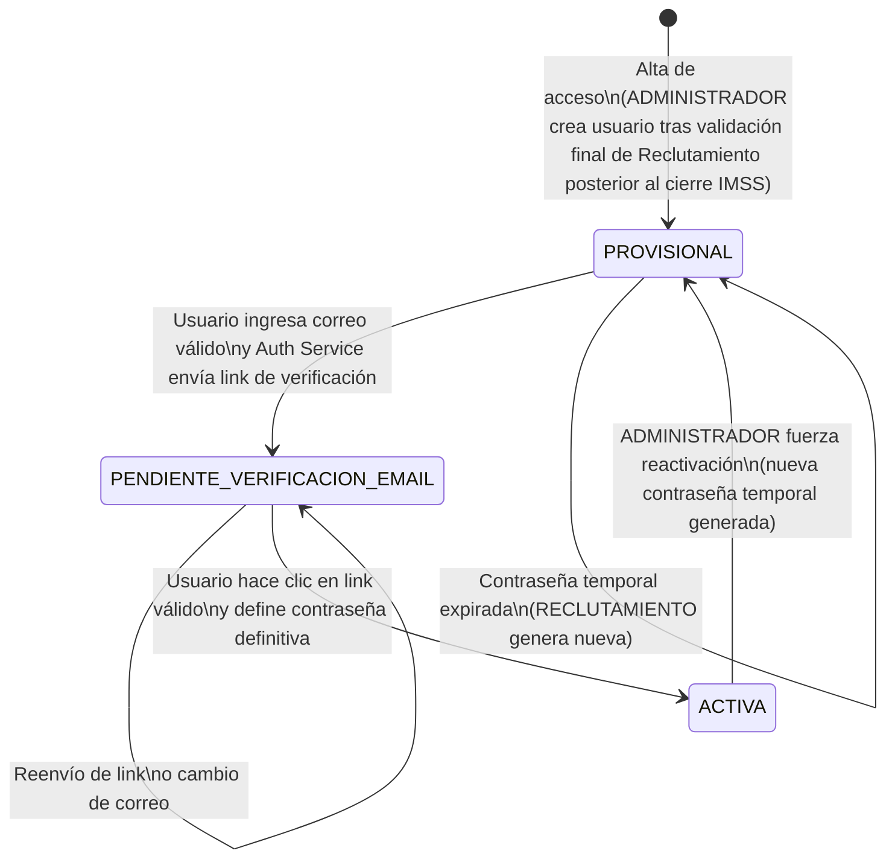

#### Tabla de estados

| Estado | Descripción | Acciones permitidas | Restricciones |
|---|---|---|---|
| PROVISIONAL | Usuario recién creado con contraseña temporal | Iniciar flujo de activación (ingresar correo) | Sin acceso a módulos operativos; contraseña expira en 72h |
| PENDIENTE_VERIFICACION_EMAIL | Correo ingresado, link de verificación enviado | Reenviar link de verificación, cambiar correo ingresado | Sin acceso a módulos operativos; link expira en 24h |
| ACTIVA | Cuenta completamente activada con correo verificado | Acceso completo según rol derivado de `puesto`, recuperación de contraseña | — |

#### Diagrama de secuencia del flujo de activación

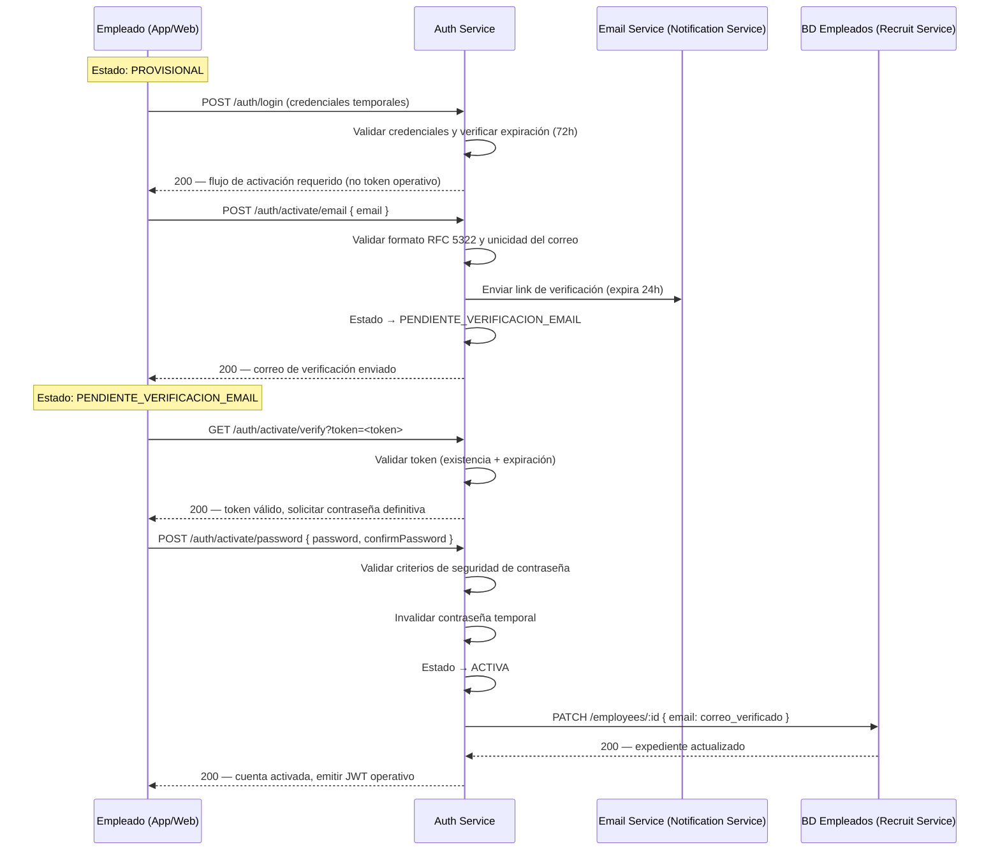

#### Pseudocódigo del proceso de activación

```typescript
// Auth Service — activación de cuenta

async function activateWithEmail(userId: string, email: string): Promise<void> {
  const user = await userRepo.findById(userId);
  if (user.status !== AccountStatus.PROVISIONAL) throw new ForbiddenError();

  const normalized = email.toLowerCase().trim();
  if (!isValidEmail(normalized)) throw new ValidationError('Formato de correo inválido');
  if (await userRepo.emailExists(normalized)) throw new ConflictError('Correo ya registrado');

  const token = generateSecureToken(); // 32 bytes hex, single-use
  await tokenRepo.save({ token, userId, expiresAt: addHours(now(), 24) });
  await notificationService.sendVerificationEmail(normalized, token);
  await userRepo.updateStatus(userId, AccountStatus.PENDIENTE_VERIFICACION_EMAIL);
}

async function verifyEmailAndSetPassword(token: string, password: string): Promise<string> {
  const record = await tokenRepo.findByToken(token);
  if (!record || record.usedAt) throw new UnauthorizedError('Token inválido');
  if (isPast(record.expiresAt)) throw new UnauthorizedError('Token expirado');

  validatePasswordStrength(password); // min 8 chars, upper, lower, digit

  await tokenRepo.markUsed(record.id);
  await userRepo.setPassword(record.userId, await hashPassword(password));
  await userRepo.invalidateTemporaryPassword(record.userId);
  await userRepo.updateStatus(record.userId, AccountStatus.ACTIVA);

  // Ligar correo al expediente del empleado
  const user = await userRepo.findById(record.userId);
  await recruitService.updateEmployeeEmail(user.employeeId, user.pendingEmail);

  return issueJWT(record.userId); // token operativo
}

async function forceReactivation(adminId: string, targetUserId: string): Promise<void> {
  const tempPassword = generateTemporaryPassword(); // 10+ chars alfanuméricos
  await userRepo.setTemporaryPassword(targetUserId, await hashPassword(tempPassword));
  await userRepo.updateStatus(targetUserId, AccountStatus.PROVISIONAL);
  await sessionStore.invalidateAllSessions(targetUserId);
  await auditLog.record({ actor: adminId, action: 'FORCE_REACTIVATION', entityId: targetUserId });
  await notificationService.notifyRecruitment({ userId: targetUserId, tempPassword });
}
```

### Audit Service — Caja Negra

```sql
-- Tabla append-only: sin UPDATE ni DELETE (enforced por trigger + RLS)
CREATE TABLE audit_log (
  id          UUID PRIMARY KEY DEFAULT gen_random_uuid(),
  ts_utc      TIMESTAMPTZ NOT NULL DEFAULT now(),
  actor_id    UUID NOT NULL,
  action      TEXT NOT NULL,
  entity_type TEXT NOT NULL,
  entity_id   UUID NOT NULL,
  old_value   JSONB,
  new_value   JSONB,
  integrity_hash TEXT NOT NULL  -- SHA-256(id||ts_utc||actor_id||action||entity_id||old_value||new_value)
);
-- Solo ADMINISTRADOR puede SELECT; nadie puede INSERT directo (solo via trigger interno)
```

Retención mínima 2 años. Verificación de hash periódica; entrada comprometida → alerta inmediata a ADMINISTRADOR.

### Offline Sync (App Móvil)

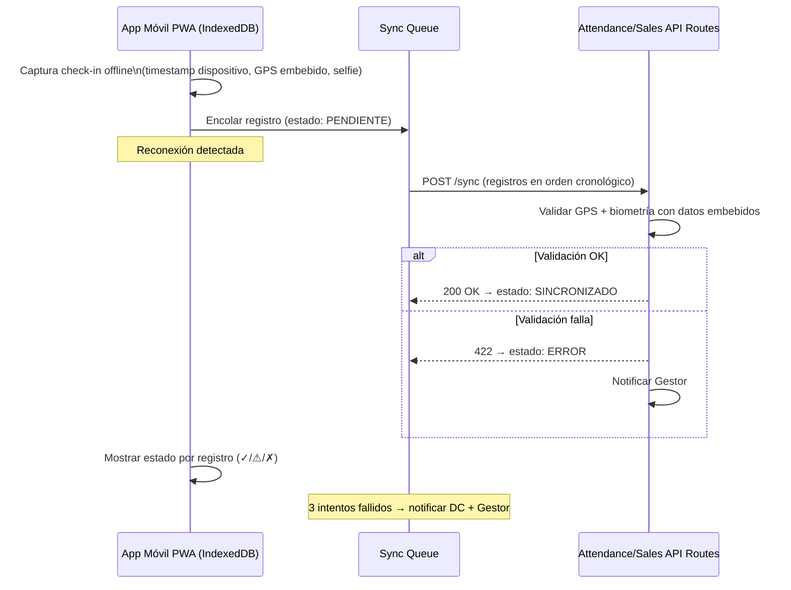

### Arquitectura Feature-First (Next.js 16)

El proyecto sigue una arquitectura feature-first optimizada para desarrollo asistido por IA. Cada módulo funcional es autocontenido con sus propios componentes, acciones, tipos y tests.

```
src/
├── app/                          # Next.js App Router
│   ├── (auth)/                   # Rutas de autenticación y activación
│   ├── (dashboard)/              # Rutas del dashboard (roles internos)
│   │   ├── asignaciones/
│   │   ├── asistencias/
│   │   ├── empleados/
│   │   ├── nomina/
│   │   ├── pdvs/
│   │   ├── reportes/
│   │   └── ...
│   ├── (cliente)/                # Rutas del portal CLIENTE (multi-tenant)
│   └── (mobile)/                 # Rutas de la PWA móvil (DC)
│       ├── checkin/
│       ├── ventas/
│       └── misiones/
│
├── features/                     # Módulos feature-first
│   ├── attendance/               # Check-in/out, faltas, retardos
│   │   ├── actions.ts            # Server Actions
│   │   ├── components/
│   │   ├── hooks/
│   │   ├── types.ts
│   │   └── __tests__/
│   ├── assignments/              # Motor de asignaciones + validaciones
│   ├── payroll/                  # Motor de nómina + Ledger
│   ├── quotas/                   # Motor de cuotas
│   ├── incidents/                # Incapacidades, vacaciones, permisos
│   ├── sales/                    # Ventas diarias
│   ├── love-isdin/               # Programa LOVE ISDIN
│   ├── audit/                    # Caja Negra
│   ├── auth/                     # Activación de cuenta, roles
│   └── clients/                  # Multi-tenancy cuentas de cliente
│
├── lib/
│   ├── supabase/                 # Cliente Supabase (server + client + middleware)
│   ├── validations/              # Zod schemas compartidos
│   └── utils/
│
└── components/
    ├── ui/                       # shadcn/ui components
    └── shared/                   # Componentes compartidos entre features
```

**Convenciones clave:**
- Server Actions para toda mutación de datos (no API routes custom salvo webhooks).
- Server Components por defecto; Client Components solo donde se requiere interactividad.
- Supabase RLS como primera línea de seguridad; la lógica de aplicación es segunda línea.
- Cada feature expone un `actions.ts` con las Server Actions y un `types.ts` con los tipos TypeScript.
- Tests en `__tests__/` dentro de cada feature; property tests con `fast-check`.

---

- **Ventas**: Supabase Realtime subscription sobre tabla `sales_events`. Latencia objetivo ≤60s.
- **Mapa promotores**: Redis Pub-Sub con posición GPS del último check-in activo. Latencia objetivo ≤120s.
- **Alertas**: Notificación push cuando cumplimiento PDV < 70% a mitad de periodo.

---

### Assignment Validation Service (Low-Level Design)

Servicio interno que valida el lote de asignaciones mensual antes de su publicación y monitorea la operación en vivo. Se ejecuta en dos momentos: (1) al publicar el plan mensual de asignaciones y (2) como job periódico durante la operación activa.

#### Clasificación de resultados

```typescript
type ValidationSeverity = 'ERROR' | 'ALERTA' | 'AVISO';

interface ValidationResult {
  severity: ValidationSeverity;
  code: string;
  asignacion_id?: string;
  dc_id?: string;
  pdv_id?: string;
  mensaje: string;
  detalle?: Record<string, unknown>;
}
```

- **ERROR**: bloquea la publicación del lote completo hasta que se corrija.
- **ALERTA**: publica la asignación pero genera notificación al SUPERVISOR y/o ADMINISTRADOR.
- **AVISO**: se emite al cierre del proceso de publicación; no bloquea ni notifica en tiempo real.

#### Motor de validación pre-publicación

```typescript
async function validateAssignmentBatch(
  batch: Asignacion[],
  periodo: Periodo
): Promise<{ canPublish: boolean; results: ValidationResult[] }> {

  const results: ValidationResult[] = [];

  for (const asig of batch) {
    // ── ERROREs (bloquean) ──────────────────────────────────────────────
    if (!await pdvRepo.exists(asig.btl_cve))
      results.push({ severity: 'ERROR', code: 'PDV_INEXISTENTE', ...asig });

    if (!await empleadoRepo.exists(asig.id_nom))
      results.push({ severity: 'ERROR', code: 'EMPLEADO_INEXISTENTE', ...asig });

    const pdv = await pdvRepo.findByBtlCve(asig.btl_cve);
    if (pdv && pdv.estatus === 'INACTIVO')
      results.push({ severity: 'ERROR', code: 'PDV_INACTIVO', ...asig });

    const dc = await empleadoRepo.findByIdNom(asig.id_nom);
    if (dc && dc.estatus === 'BAJA')
      results.push({ severity: 'ERROR', code: 'DC_DADO_DE_BAJA', ...asig });

    if (dc && dc.puesto !== 'DERMOCONSEJERO')
      results.push({ severity: 'ERROR', code: 'DC_SIN_ROL_DC', ...asig });

    if (pdv && (!pdv.lat || !pdv.lng || !pdv.radio_tolerancia_metros))
      results.push({ severity: 'ERROR', code: 'PDV_SIN_GEOCERCA', ...asig });

    if (pdv && !await supervisorRepo.hasActiveSupervisor(pdv.id))
      results.push({ severity: 'ERROR', code: 'PDV_SIN_SUPERVISOR', ...asig });

    if (!isValidDiasLaborales(asig.dias_laborales))
      results.push({ severity: 'ERROR', code: 'DIAS_LABORALES_INVALIDOS', ...asig });

    if (hasContradictoryRest(asig.dias_laborales, asig.dia_descanso))
      results.push({ severity: 'ERROR', code: 'DESCANSOS_CONTRADICTORIOS', ...asig });

    if (await hasDoubleObligatoryAssignment(asig, batch))
      results.push({ severity: 'ERROR', code: 'DOBLE_ASIGNACION_OBLIGATORIA', ...asig });

    const cuota = await cuotaRepo.findByPdvPeriodo(asig.pdv_id, periodo.id);
    if (!cuota || cuota.valor_total <= 0)
      results.push({ severity: 'ERROR', code: 'CUOTA_INVALIDA', ...asig });

    // ── ALERTAs (publican pero notifican) ───────────────────────────────
    if (dc && (!dc.telefono || !dc.correo))
      results.push({ severity: 'ALERTA', code: 'DC_SIN_CONTACTO', ...asig });

    if (pdv && (pdv.radio_tolerancia_metros < 50 || pdv.radio_tolerancia_metros > 300))
      results.push({ severity: 'ALERTA', code: 'GEOCERCA_FUERA_DE_RANGO',
        detalle: { radio: pdv.radio_tolerancia_metros }, ...asig });

    if (asig.tipo === 'ROTATIVA' && await countPdvsPerWeek(asig) > 3)
      results.push({ severity: 'ALERTA', code: 'ROTATIVA_SOBRECARGADA', ...asig });

    if (has7ConsecutiveDaysWithoutRest(asig.dias_laborales))
      results.push({ severity: 'ALERTA', code: 'SIN_DESCANSO_SEMANAL', ...asig });

    if (dc && await incapacidadRepo.hasActiveOverlap(dc.id, asig.fecha_inicio, asig.fecha_fin))
      results.push({ severity: 'ALERTA', code: 'DC_CON_INCAPACIDAD_ACTIVA', ...asig });

    if (dc && await vacacionesRepo.hasApprovedInMonth(dc.id, periodo.mes))
      results.push({ severity: 'ALERTA', code: 'DC_CON_VACACIONES_APROBADAS', ...asig });

    if (pdv && pdv.cadena === 'SAN PABLO' && !await horarioRepo.hasWeeklySchedule(pdv.id, periodo))
      results.push({ severity: 'ALERTA', code: 'PDV_SIN_HORARIOS_SAN_PABLO', ...asig });
  }

  // ── AVISOs (al cierre del proceso) ──────────────────────────────────
  const pdvsSinCobertura = await pdvRepo.findActivosWithoutAssignment(batch, periodo);
  for (const pdv of pdvsSinCobertura)
    results.push({ severity: 'AVISO', code: 'PDV_SIN_COBERTURA', pdv_id: pdv.id, mensaje: pdv.nombre });

  const dcsSinAsignacion = await empleadoRepo.findActiveDCsWithoutAssignment(batch, periodo);
  for (const dc of dcsSinAsignacion)
    results.push({ severity: 'AVISO', code: 'DC_SIN_ASIGNACION', dc_id: dc.id, mensaje: dc.nombre });

  const hasErrors = results.some(r => r.severity === 'ERROR');
  return { canPublish: !hasErrors, results };
}
```

#### Alertas de operación en vivo (job periódico)

```typescript
// Ejecutado cada N minutos (configurable en Módulo 17 — Reglas)
async function runLiveOperationAlerts(config: LiveAlertConfig): Promise<void> {

  // Alerta: DC sin check-in después de tolerancia
  const dcsSinCheckin = await asignacionRepo.findDCsWithMissedCheckin(config.toleranciaMinutos);
  for (const dc of dcsSinCheckin)
    await notifService.alertSupervisor(dc.supervisor_id, 'DC_SIN_CHECKIN', dc);

  // Alerta: fuera de geocerca 3 días consecutivos
  const dcsFueraGeo = await checkinRepo.findConsecutiveOutOfGeofence(3);
  for (const dc of dcsFueraGeo)
    await notifService.alertSupervisorAndAdmin(dc.supervisor_id, 'FUERA_DE_GEOCERCA_MASIVO', dc);

  // Alerta: retardos masivos en PDV (>50% de días del mes)
  const pdvsConRetardos = await retardoRepo.findPdvsWithMassiveDelays(0.5);
  for (const pdv of pdvsConRetardos)
    await notifService.alertSupervisor(pdv.supervisor_id, 'RETARDOS_MASIVOS_PDV', pdv);

  // Alerta: cola offline atorada >48h con PDV obligatorio
  const dcsCola = await syncQueueRepo.findStuckQueues(48 * 60);
  for (const dc of dcsCola)
    await notifService.alertSupervisorAndAdmin(dc.supervisor_id, 'COLA_OFFLINE_ATORADA', dc);
}
```

#### Tabla de códigos de validación

| Código | Severidad | Bloquea | Destinatario |
|---|---|---|---|
| `PDV_INEXISTENTE` | ERROR | Sí | ADMINISTRADOR |
| `EMPLEADO_INEXISTENTE` | ERROR | Sí | ADMINISTRADOR |
| `PDV_INACTIVO` | ERROR | Sí | ADMINISTRADOR |
| `DC_DADO_DE_BAJA` | ERROR | Sí | ADMINISTRADOR |
| `DC_SIN_ROL_DC` | ERROR | Sí | ADMINISTRADOR |
| `PDV_SIN_GEOCERCA` | ERROR | Sí | ADMINISTRADOR |
| `PDV_SIN_SUPERVISOR` | ERROR | Sí | ADMINISTRADOR |
| `DIAS_LABORALES_INVALIDOS` | ERROR | Sí | ADMINISTRADOR |
| `DESCANSOS_CONTRADICTORIOS` | ERROR | Sí | ADMINISTRADOR |
| `DOBLE_ASIGNACION_OBLIGATORIA` | ERROR | Sí | ADMINISTRADOR |
| `CUOTA_INVALIDA` | ERROR | Sí | ADMINISTRADOR |
| `DC_SIN_CONTACTO` | ALERTA | No | ADMINISTRADOR + SUPERVISOR |
| `GEOCERCA_FUERA_DE_RANGO` | ALERTA | No | ADMINISTRADOR |
| `ROTATIVA_SOBRECARGADA` | ALERTA | No | ADMINISTRADOR + SUPERVISOR |
| `SIN_DESCANSO_SEMANAL` | ALERTA | No | ADMINISTRADOR + SUPERVISOR |
| `DC_CON_INCAPACIDAD_ACTIVA` | ALERTA | No | ADMINISTRADOR + SUPERVISOR |
| `DC_CON_VACACIONES_APROBADAS` | ALERTA | No | ADMINISTRADOR + SUPERVISOR |
| `PDV_SIN_HORARIOS_SAN_PABLO` | ALERTA | No | SUPERVISOR |
| `PDV_SIN_COBERTURA` | AVISO | No | ADMINISTRADOR |
| `DC_SIN_ASIGNACION` | AVISO | No | ADMINISTRADOR |
| `DC_SIN_CHECKIN` | ALERTA LIVE | No | SUPERVISOR |
| `FUERA_DE_GEOCERCA_MASIVO` | ALERTA LIVE | No | SUPERVISOR + ADMINISTRADOR |
| `RETARDOS_MASIVOS_PDV` | ALERTA LIVE | No | SUPERVISOR |
| `COLA_OFFLINE_ATORADA` | ALERTA LIVE | No | SUPERVISOR + ADMINISTRADOR |

---

## Data Models

### Entidades Principales

```mermaid
erDiagram
  EMPLOYEE {
    uuid id PK
    string puesto
    string nombre
    uuid pdv_id FK
    uuid supervisor_id FK
    string foto_referencia_url
    decimal salario_base_diario
    boolean activo
  }

  PDV {
    uuid id PK
    string nombre
    string cadena
    decimal lat
    decimal lng
    int radio_tolerancia_metros
    uuid supervisor_id FK
    time horario_entrada
    time horario_salida
    time horario_limite_checkout
  }

  MISION_CATALOGO {
    uuid id PK
    string instruccion
    string descripcion
    boolean activa
    uuid creado_por FK
    timestamptz creado_en
  }

  CHECKIN {
    uuid id PK
    uuid dc_id FK
    uuid pdv_id FK
    timestamptz ts_utc
    decimal lat
    decimal lng
    string selfie_hash
    string selfie_url
    enum estado "VALIDO|RECHAZADO|PENDIENTE_VALIDACION"
    int distancia_metros
    decimal similitud_biometrica
    uuid mision_id FK
    string mision_instruccion
  }

  CHECKOUT {
    uuid id PK
    uuid checkin_id FK
    timestamptz ts_utc
    int duracion_minutos
    boolean tardio
  }

  SALE {
    uuid id PK
    uuid dc_id FK
    uuid pdv_id FK
    uuid checkin_id FK
    uuid producto_id FK
    int cantidad
    decimal valor
    timestamptz ts_utc
    boolean confirmada
  }

  PERIODO {
    uuid id PK
    date fecha_inicio
    date fecha_fin
    enum tipo "QUINCENAL|MENSUAL"
    enum estado "ABIERTO|CERRADO"
    timestamptz cerrado_en
  }

  PRENOMINA {
    uuid id PK
    uuid dc_id FK
    uuid periodo_id FK
    int dias_trabajados
    decimal ventas_confirmadas
    decimal bono
    decimal deducciones
    decimal total
    timestamptz calculado_en
  }

  LEDGER_ENTRY {
    uuid id PK
    uuid dc_id FK
    uuid periodo_origen FK
    uuid periodo_aplicacion FK
    decimal monto
    string concepto
    uuid creado_por FK
    uuid aprobado_por FK
    timestamptz ts_utc
  }

  CUOTA_PDV {
    uuid id PK
    uuid pdv_id FK
    uuid periodo_id FK
    decimal valor_total
  }

  CUOTA_INDIVIDUAL {
    uuid id PK
    uuid dc_id FK
    uuid pdv_id FK
    uuid periodo_id FK
    decimal valor
    int dias_activos
    string justificacion
  }

  INCAPACIDAD {
    uuid id PK
    uuid dc_id FK
    date fecha_inicio
    date fecha_fin
    string doc_foto_url
    enum estado "BORRADOR|ENVIADA|VALIDADA_SUP|REGISTRADA_RH"
    uuid aprobado_sup FK
    uuid registrado_rh FK
    timestamptz ts_enviada
    timestamptz ts_validada
    timestamptz ts_registrada
  }

  RETARDO {
    uuid id PK
    uuid dc_id FK
    date fecha
    int minutos
    boolean confirmado
    boolean justificado
  }

  FALTA_ADMINISTRATIVA {
    uuid id PK
    uuid dc_id FK
    date fecha
    string origen "3_RETARDOS"
    decimal descuento_aplicado
    uuid anulada_por FK
    timestamptz ts_anulacion
  }

  AUDIT_LOG {
    uuid id PK
    timestamptz ts_utc
    uuid actor_id FK
    string action
    string entity_type
    uuid entity_id
    jsonb old_value
    jsonb new_value
    string integrity_hash
  }

  CUENTA_CLIENTE {
    uuid id PK
    string nombre
    string identificador_unico
    boolean activa
    timestamptz creado_en
  }

  CLIENTE_PDV {
    uuid cuenta_cliente_id FK
    uuid pdv_id FK
  }

  EMPLOYEE ||--o{ CHECKIN : "realiza"
  MISION_CATALOGO ||--o{ CHECKIN : "presentada en"
  EMPLOYEE ||--o{ SALE : "registra"
  EMPLOYEE ||--o{ PRENOMINA : "tiene"
  EMPLOYEE ||--o{ CUOTA_INDIVIDUAL : "tiene"
  EMPLOYEE ||--o{ INCAPACIDAD : "solicita"
  EMPLOYEE ||--o{ RETARDO : "acumula"
  PDV ||--o{ CHECKIN : "recibe"
  PDV ||--o{ CUOTA_PDV : "tiene"
  CHECKIN ||--o| CHECKOUT : "cierra"
  PERIODO ||--o{ PRENOMINA : "agrupa"
  PERIODO ||--o{ LEDGER_ENTRY : "referencia"
  CUOTA_PDV ||--o{ CUOTA_INDIVIDUAL : "distribuye"
  CUENTA_CLIENTE ||--o{ CLIENTE_PDV : "tiene asignados"
  PDV ||--o{ CLIENTE_PDV : "pertenece a"
```

### Schedule (Jerarquía de Horarios)

```typescript
interface ScheduleSnapshot {
  dc_id: string;
  date: string;           // ISO date
  nivel: ScheduleLevel;
  hora_entrada: string;   // HH:mm
  hora_salida: string;
  tolerancia_min: number;
  snapshot_ts: string;    // inmutable al momento del check-in
}
```

---
## Correctness Properties

*A property is a characteristic or behavior that should hold true across all valid executions of a system — essentially, a formal statement about what the system should do. Properties serve as the bridge between human-readable specifications and machine-verifiable correctness guarantees.*

### Property 1: Misión del Día — variabilidad garantizada

*Para cualquier* DC que realice dos check-ins consecutivos en el mismo PDV, la instrucción de Misión del Día presentada en el segundo check-in debe ser diferente a la presentada en el check-in inmediatamente anterior del mismo DC en ese PDV.

**Validates: Requirements 1.11**

---

### Property 2: Misión del Día registrada en el check-in válido

*Para cualquier* check-in que supere ambas validaciones (GPS y biométrica), el registro persistido debe contener el identificador y la instrucción exacta de la Misión del Día que se presentó al DC en ese check-in.

**Validates: Requirements 1.7**

---

### Property 3: Validación GPS — decisión correcta

*Para cualquier* par (coordenadas del dispositivo, PDV con radio de tolerancia configurado), el Validador GPS debe aceptar el check-in si y solo si la distancia haversine entre las coordenadas y el PDV es menor o igual al radio de tolerancia; en caso de rechazo, la respuesta debe incluir la distancia de desviación en metros.

**Validates: Requirements 1.2, 1.3**

---

### Property 2: Validación biométrica — decisión correcta

*Para cualquier* par (selfie capturada, foto de referencia del DC) y umbral de similitud configurable, el Validador Biométrico debe aceptar el check-in si y solo si el score de similitud es mayor o igual al umbral; si rechaza, debe registrar el intento fallido con timestamp y coordenadas.

**Validates: Requirements 1.4, 1.5**

---

### Property 3: Check-in válido contiene todos los campos requeridos

*Para cualquier* check-in que supere ambas validaciones (GPS y biométrica), el registro persistido debe contener: timestamp UTC, coordenadas exactas, hash SHA-256 de la selfie, y estado VALIDO.

**Validates: Requirements 1.6**

---

### Property 6: Bloqueo de ventas y Tareas de Visita sin check-in activo

*Para cualquier* DC que no tenga un check-in en estado VALIDO activo en un PDV, todo intento de registrar una venta o ejecutar una Tarea de Visita en ese PDV debe ser rechazado por el sistema.

**Validates: Requirements 1.8, 12.6**

---

### Property 7: Bloqueo de check-out con Tareas de Visita obligatorias pendientes

*Para cualquier* visita que tenga al menos una Tarea de Visita obligatoria en estado distinto a COMPLETADA o JUSTIFICADA, el intento de check-out debe ser bloqueado y la lista de tareas pendientes debe ser retornada.

**Validates: Requirements 2.1, 2.2**

---

### Property 6: Check-out registra timestamp UTC y cierra visita

*Para cualquier* check-out confirmado por el DC, el registro debe contener timestamp UTC y la visita debe quedar en estado CERRADA; ninguna venta ni misión adicional puede registrarse en esa visita después del cierre.

**Validates: Requirements 2.4**

---

### Property 7: Duración de visita es la diferencia exacta de timestamps

*Para cualquier* par (check-in válido, check-out correspondiente), la duración calculada de la visita debe ser exactamente `ts_checkout - ts_checkin` en minutos enteros, sin redondeo ni ajuste.

**Validates: Requirements 2.5**

---

### Property 8: Check-out tardío automático al pasar el horario límite

*Para cualquier* visita con check-in activo que no tenga check-out registrado al momento en que el reloj del sistema supera el horario límite configurado para el PDV, el sistema debe registrar automáticamente un check-out tardío y notificar al Gestor responsable.

**Validates: Requirements 2.6**

---

### Property 11: Tarea de Visita generada tiene exactamente k tareas del conjunto de la plantilla

*Para cualquier* plantilla de Tarea de Visita con N tareas y configuración de variabilidad k (donde k ≤ N), el conjunto de tareas generado para una visita debe contener exactamente k tareas, todas pertenecientes al conjunto de la plantilla, sin repetición.

**Validates: Requirements 3.2**

---

### Property 10: Imagen marcada como sospechosa si falta metadata o coords inconsistentes

*Para cualquier* imagen enviada en un flujo de evidencia, si la imagen no contiene metadata EXIF de cámara en vivo, o si las coordenadas embebidas difieren en más de la tolerancia configurada respecto al check-in activo, el sistema debe marcar la tarea como sospechosa y notificar al Gestor.

**Validates: Requirements 3.4, 12.4**

---

### Property 13: Tarea de Visita completada tiene timestamps de inicio y fin

*Para cualquier* Tarea de Visita individual que alcance el estado COMPLETADA, el registro debe contener tanto el timestamp de inicio como el de fin, y el fin debe ser posterior al inicio.

**Validates: Requirements 3.5**

---

### Property 12: Falta registrada cuando no hay check-in válido ni cobertura aprobada

*Para cualquier* DC y cualquier día laboral (no feriado, no descanso) en el que no exista un check-in en estado VALIDO ni una cobertura en estado APROBADA, el sistema debe registrar ese día como Falta para ese DC.

**Validates: Requirements 4.1, 12.1 (asistencia)**

---

### Property 13: Cobertura no elimina falta sin aprobación del Administrador

*Para cualquier* cobertura registrada por un Gestor que aún no tenga aprobación del Administrador, el día correspondiente debe seguir contando como Falta potencial para el DC; la falta solo se anula cuando la cobertura alcanza el estado APROBADA.

**Validates: Requirements 4.4**

---

### Property 14: Check-in en PDV no asignado sin cobertura genera Falta en PDV asignado

*Para cualquier* DC que registre un check-in válido en un PDV distinto al asignado, sin tener una cobertura aprobada para ese PDV en ese día, el PDV asignado habitualmente debe registrar una Falta para ese DC en ese día.

**Validates: Requirements 4.5**

---

### Property 15: Pre-nómina se recalcula ante cualquier evento relevante

*Para cualquier* DC, después de registrar un check-in válido, un check-out, o una venta confirmada, el valor de pre-nómina del DC para el periodo activo debe ser diferente (o igual si el delta es cero) al valor previo al evento, y debe reflejar el nuevo estado de los datos.

**Validates: Requirements 5.1**

---

### Property 16: Periodo cerrado es inmutable

*Para cualquier* periodo en estado CERRADO, todo intento de modificar, insertar o eliminar registros de asistencia, ventas o cálculos de nómina que pertenezcan a ese periodo debe ser rechazado por el sistema; los valores de pre-nómina quedan congelados en el momento del cierre.

**Validates: Requirements 5.4, 6.1**

---

### Property 17: Fórmula de pre-nómina correcta

*Para cualquier* DC y periodo activo, el valor calculado de pre-nómina debe ser igual a: `(dias_trabajados × salario_base_diario) + bono_por_cuota - deducciones_por_falta + SUM(ledger_entries_pendientes)`, donde cada componente se calcula según las reglas configuradas por el Administrador.

**Validates: Requirements 5.5, 6.3**

---

### Property 18: Inconsistencia en datos excluye registro del cálculo y lo registra en log

*Para cualquier* dato de entrada al Motor de Nómina que presente una inconsistencia detectable (timestamps inválidos, valores negativos donde no aplica, referencias a entidades inexistentes), el registro afectado debe ser excluido del cálculo de pre-nómina y la inconsistencia debe quedar registrada en el log de auditoría.

**Validates: Requirements 5.6**

---

### Property 19: Entrada de Ledger contiene todos los campos de trazabilidad

*Para cualquier* entrada creada en el Ledger, el registro debe contener: `dc_id`, `periodo_origen`, `periodo_aplicacion`, `monto`, `concepto`, `creado_por`, `timestamp_utc`; y el `periodo_aplicacion` debe ser siempre el periodo activo o siguiente, nunca un periodo cerrado.

**Validates: Requirements 6.2, 6.4**

---

### Property 20: Entrada de Ledger mayor al 30% del salario requiere segunda aprobación

*Para cualquier* entrada de Ledger cuyo valor absoluto supere el 30% del salario base mensual del DC afectado, el sistema debe bloquear su aplicación hasta recibir aprobación de un Administrador distinto al que creó la entrada.

**Validates: Requirements 6.6**

---

### Property 21: Alerta de cumplimiento cuando PDV cae bajo el umbral a mitad de periodo

*Para cualquier* PDV cuyo porcentaje de cumplimiento de cuota caiga por debajo del umbral configurado (por defecto 70%) en la fecha que corresponde a la mitad del periodo activo, el sistema debe generar una notificación push al Gestor responsable de ese PDV.

**Validates: Requirements 7.5**

---

### Property 22: Distribución proporcional de Cuota Individual por días trabajados

*Para cualquier* PDV con cuota asignada y N DCs que lo atendieron en un periodo, la Cuota Individual de cada DC debe ser proporcional a los días efectivamente trabajados en ese PDV: `CI(dc) = cuota_pdv × (dias_activos_dc / dias_laborables_pdv)`.

**Validates: Requirements 8.2**

---

### Property 23: Cobertura aprobada incrementa Cuota Individual proporcionalmente

*Para cualquier* DC con cobertura aprobada en un PDV adicional durante un periodo, su Cuota Individual total debe incrementarse en la porción proporcional de la cuota del PDV cubierto, calculada sobre los días de cobertura efectiva.

**Validates: Requirements 8.3**

---

### Property 24: Falta redistribuye cuota del día conservando la invariante

*Para cualquier* PDV y cualquier día en que un DC registre una Falta, la porción de cuota correspondiente a ese día debe redistribuirse entre los DCs que sí trabajaron en ese PDV ese día, de forma que la suma total de Cuotas Individuales del PDV en el periodo permanezca igual a la Cuota total del PDV.

**Validates: Requirements 8.4, 12.32**

---

### Property 25: Invariante de cuotas — suma de CI siempre igual a cuota total del PDV

*Para cualquier* PDV y cualquier periodo, después de cualquier operación (asignación inicial, falta, cobertura, ajuste manual, incapacidad, vacaciones), la suma de todas las Cuotas Individuales asignadas a ese PDV en ese periodo debe ser exactamente igual a la Cuota total del PDV para ese periodo.

**Validates: Requirements 8.5, 12.31**

---

### Property 26: Modificación manual de cuota recalcula todas las CI afectadas y registra en audit log

*Para cualquier* modificación manual de la Cuota de un PDV durante un periodo activo, el Motor de Cuotas debe recalcular todas las Cuotas Individuales afectadas y registrar el cambio en el log de auditoría con el valor anterior y el nuevo valor.

**Validates: Requirements 8.7**

---

### Property 27: Rol derivado exactamente del campo `puesto`

*Para cualquier* empleado en el sistema, el rol efectivo que determina sus permisos debe ser exactamente el derivado del valor actual del campo `puesto` en la base de datos de empleados, sin ningún campo de rol separado que pueda divergir.

**Validates: Requirements 9.1**

---

### Property 28: RBAC — cada rol accede solo a sus funciones permitidas

*Para cualquier* usuario autenticado y cualquier función del sistema, el acceso debe ser concedido si y solo si el rol derivado del `puesto` del usuario incluye esa función en su conjunto de permisos definido en los requisitos 9.2–9.14.

**Validates: Requirements 9.2, 9.3, 9.4, 9.5, 9.6, 9.7, 9.8, 9.9, 9.10, 9.11, 9.12, 9.13, 9.14**

---

### Property 29: Acceso no autorizado retorna 403 y se registra en audit log

*Para cualquier* intento de acceso a una función o dato fuera de los permisos del rol del usuario, el sistema debe retornar HTTP 403 y registrar el intento en el log de auditoría con usuario, timestamp, función solicitada y rol del usuario.

**Validates: Requirements 9.16**

---

### Property 30: Registro offline almacenado con timestamp y estado PENDIENTE

*Para cualquier* acción (check-in, venta, misión) ejecutada por la App Móvil sin conexión a internet, el registro debe almacenarse localmente con el timestamp del dispositivo en el momento de la acción y en estado PENDIENTE_SYNC.

**Validates: Requirements 10.2**

---

### Property 31: Sincronización offline respeta orden cronológico

*Para cualquier* cola de registros offline pendientes de sincronización, cuando la App Móvil recupera conexión, los registros deben enviarse al servidor en orden estrictamente cronológico por timestamp del dispositivo.

**Validates: Requirements 10.3**

---

### Property 32: Tres fallos de sincronización generan notificación a DC y Gestor

*Para cualquier* registro offline que falle la sincronización con el servidor tres veces consecutivas, el sistema debe notificar tanto al DC como al Gestor responsable con el detalle del error.

**Validates: Requirements 10.6**

---

### Property 33: Audit log contiene todos los campos requeridos para cada acción crítica

*Para cualquier* acción que modifique datos de asistencia, ventas, nómina o configuración, la entrada generada en el audit log debe contener: `actor_id`, `ts_utc`, `entity_type`, `entity_id`, `old_value`, `new_value`, y `integrity_hash`.

**Validates: Requirements 11.1**

---

### Property 34: Hash de integridad del audit log es verificable (round-trip)

*Para cualquier* entrada del audit log, el hash de integridad almacenado debe ser igual al SHA-256 calculado sobre la concatenación de sus campos (`id || ts_utc || actor_id || action || entity_id || old_value || new_value`); la verificación debe ser determinista y reproducible.

**Validates: Requirements 11.4**

---

### Property 35: Tampering en audit log es detectado y notificado

*Para cualquier* entrada del audit log cuyo contenido haya sido modificado después de su creación (hash no coincide con contenido recalculado), el sistema debe marcar esa entrada como COMPROMETIDA y notificar al Administrador.

**Validates: Requirements 11.5**

---

### Property 36: Ningún DC tiene más de un PDV asignado el mismo día

*Para cualquier* conjunto de asignaciones diarias procesadas por el Motor de Cuotas, ningún DC debe aparecer asignado a más de un PDV en el mismo día calendario; cualquier operación que viole esta restricción debe ser rechazada.

**Validates: Requirements 12.1**

---

### Property 37: Timestamp visible incrustado en toda foto de evidencia

*Para cualquier* fotografía capturada en un flujo de evidencia (check-in, misión, incapacidad, visita de supervisor), la imagen almacenada y enviada al servidor debe contener un timestamp visible incrustado en el píxel de la imagen antes de su almacenamiento.

**Validates: Requirements 12.5**

---

### Property 38: Check-out bloqueado sin ventas confirmadas

*Para cualquier* DC que intente ejecutar un check-out en una visita que no tenga al menos una venta confirmada, el sistema debe bloquear el check-out y retornar un mensaje indicando que se requiere al menos un registro de venta.

**Validates: Requirements 12.7**

---

### Property 39: Check-in sin GPS disponible genera estado PENDIENTE_VALIDACION y flujo de aprobación

*Para cualquier* intento de check-in en el que el GPS del dispositivo no esté disponible o no obtenga señal, el sistema debe registrar el check-in en estado PENDIENTE_VALIDACION (no rechazarlo), notificar al SUPERVISOR responsable, y habilitar el flujo de aprobación/rechazo manual en el Dashboard.

**Validates: Requirements 12.8, 12.9, 12.10, 12.11**

---

### Property 40: Incidencia REGISTRADA anula faltas y retardos en fechas cubiertas

*Para cualquier* incidencia (vacaciones, incapacidad, permiso, cumpleaños) que alcance el estado REGISTRADA_RH o REGISTRADA, el Motor de Nómina debe anular automáticamente todas las Faltas injustificadas y Retardos registrados para el DC en las fechas cubiertas por la incidencia.

**Validates: Requirements 12.12, 12.19**

---

### Property 41: Flujo jerárquico de incidencias respeta el orden DC → SUPERVISOR → COORDINADOR

*Para cualquier* solicitud de incidencia, el sistema debe impedir que alcance el estado VALIDADA_SUP sin aprobación del SUPERVISOR, y debe impedir que alcance el estado REGISTRADA sin aprobación del COORDINADOR; ningún rol puede saltarse un nivel de la jerarquía.

**Validates: Requirements 12.13**

---

### Property 42: Solicitud con menos de 30 días de anticipación es rechazada automáticamente

*Para cualquier* solicitud de vacaciones o registro de cumpleaños cuya fecha de inicio sea menor a 30 días naturales desde la fecha de creación de la solicitud, el sistema debe rechazarla automáticamente con el motivo correspondiente, sin requerir intervención manual.

**Validates: Requirements 12.14**

---

### Property 43: Días feriados configurados no generan faltas ni retardos

*Para cualquier* día configurado como feriado en el catálogo del Administrador, ningún DC debe tener registrada una Falta o Retardo en ese día, independientemente de si realizó o no un check-in.

**Validates: Requirements 12.15**

---

### Property 44: Lógica de bloques de incapacidad — días 1-3 pagados, día 4+ sin pago

*Para cualquier* bloque continuo de incapacidad (días consecutivos sin Asistencia Normal entre folios), los primeros 3 días deben marcarse como IP o ISP (pagados al 100% del sueldo base), y el día 4 en adelante del mismo bloque debe marcarse como I o IS (justificado sin pago por parte de la empresa).

**Validates: Requirements 12.20, 12.21**

---

### Property 45: Asistencia normal después de incapacidad reinicia el contador de días pagados

*Para cualquier* DC que registre una Asistencia Normal después de un bloque de incapacidad, el contador de días pagados del Motor de Nómina debe reiniciarse a cero, de modo que una incapacidad futura inicie un nuevo bloque con derecho a 3 días pagados.

**Validates: Requirements 12.22**

---

### Property 46: Jerarquía de 6 niveles resuelve el horario correctamente

*Para cualquier* DC y cualquier fecha, el horario resuelto por el sistema debe ser el del nivel más alto de la jerarquía que tenga configuración para ese DC y esa fecha; si ningún nivel tiene configuración, el sistema debe lanzar un error de configuración.

**Validates: Requirements 12.23**

---

### Property 47: Cambios de horario San Pablo no afectan días pasados de la semana en curso

*Para cualquier* PDV de la cadena San Pablo, si el Administrador actualiza el horario a mitad de una semana en curso, los días de esa semana que ya han transcurrido deben conservar el horario que tenían al momento de su check-in; solo los días futuros de esa semana deben reflejar el nuevo horario.

**Validates: Requirements 12.24, 12.25**

---

### Property 48: Snapshot de horario es inmutable al momento del check-in

*Para cualquier* check-in registrado, el snapshot del horario resuelto que se inyecta en la asignación del día debe ser inmutable después de su captura; cambios posteriores al horario no deben afectar el snapshot ya almacenado.

**Validates: Requirements 12.26**

---

### Property 49: Tres retardos confirmados en el mismo mes generan Falta Administrativa con descuento

*Para cualquier* DC cuyo contador mensual de retardos confirmados (no justificados) alcance 3 en el mismo mes calendario, el sistema debe generar automáticamente una Falta Administrativa con fecha del tercer retardo, aplicar el descuento equivalente a 1 día de salario base en la pre-nómina, y notificar al SUPERVISOR y al rol NÓMINA; la anulación de esta falta requiere aprobación del COORDINADOR.

**Validates: Requirements 12.27, 12.28, 12.29, 12.30**

---

### Property 50: Cuota total del SUPERVISOR es la suma de cuotas de sus PDVs

*Para cualquier* SUPERVISOR y cualquier periodo activo, la cuota total calculada para ese SUPERVISOR debe ser exactamente la suma de las Cuotas de todos los PDVs que tiene asignados en ese periodo, actualizándose automáticamente cuando se agreguen o remuevan PDVs de su asignación.

**Validates: Requirements 12.33**

---

### Property 51: ERROR bloquea publicación del lote de asignaciones

*Para cualquier* lote de asignaciones que contenga al menos un resultado de severidad ERROR, el sistema debe rechazar la publicación completa del lote y retornar la lista de errores; ninguna asignación del lote debe quedar en estado publicado hasta que todos los errores sean corregidos.

**Validates: Requirements 14.1–14.11**

---

### Property 52: PDV inexistente genera ERROR y bloquea

*Para cualquier* asignación cuyo `BTL_CVE` no corresponda a un PDV existente en el catálogo, el motor de validación debe producir exactamente un resultado con código `PDV_INEXISTENTE` y severidad ERROR.

**Validates: Requirements 14.1**

---

### Property 53: Empleado inexistente genera ERROR y bloquea

*Para cualquier* asignación cuyo `IDNOM` no corresponda a un empleado existente en el catálogo, el motor de validación debe producir exactamente un resultado con código `EMPLEADO_INEXISTENTE` y severidad ERROR.

**Validates: Requirements 14.2**

---

### Property 54: PDV inactivo genera ERROR y bloquea

*Para cualquier* asignación que referencie un PDV con estatus INACTIVO, el motor de validación debe producir exactamente un resultado con código `PDV_INACTIVO` y severidad ERROR.

**Validates: Requirements 14.3**

---

### Property 55: DC dado de baja genera ERROR y bloquea

*Para cualquier* asignación que referencie un empleado con estatus de baja, el motor de validación debe producir exactamente un resultado con código `DC_DADO_DE_BAJA` y severidad ERROR.

**Validates: Requirements 14.4**

---

### Property 56: DC sin rol DERMOCONSEJERO genera ERROR y bloquea

*Para cualquier* asignación que referencie un empleado cuyo campo `puesto` no sea DERMOCONSEJERO, el motor de validación debe producir exactamente un resultado con código `DC_SIN_ROL_DC` y severidad ERROR.

**Validates: Requirements 14.5**

---

### Property 57: PDV sin geocerca completa genera ERROR y bloquea

*Para cualquier* asignación que referencie un PDV sin latitud, longitud o radio de tolerancia configurados, el motor de validación debe producir exactamente un resultado con código `PDV_SIN_GEOCERCA` y severidad ERROR.

**Validates: Requirements 14.6**

---

### Property 58: Doble asignación obligatoria el mismo día genera ERROR y bloquea

*Para cualquier* par de asignaciones del mismo DC en el mismo mes que marquen el mismo día calendario como día laboral obligatorio, el motor de validación debe producir exactamente un resultado con código `DOBLE_ASIGNACION_OBLIGATORIA` y severidad ERROR para las asignaciones en conflicto.

**Validates: Requirements 14.10**

---

### Property 59: Cuota inválida genera ERROR y bloquea

*Para cualquier* asignación cuyo PDV no tenga cuota configurada o tenga cuota con valor nulo, negativo o cero para el periodo, el motor de validación debe producir exactamente un resultado con código `CUOTA_INVALIDA` y severidad ERROR.

**Validates: Requirements 14.11**

---

### Property 60: ALERTA no bloquea publicación pero genera notificación

*Para cualquier* asignación que produzca únicamente resultados de severidad ALERTA (sin ERROREs), el sistema debe publicar la asignación y generar exactamente una notificación por cada ALERTA al destinatario correspondiente según la tabla de códigos de validación.

**Validates: Requirements 14.12–14.18**

---

### Property 61: Geocerca fuera de rango genera ALERTA con valor configurado

*Para cualquier* asignación cuyo PDV tenga radio de tolerancia menor a 50 metros o mayor a 300 metros, el motor de validación debe producir exactamente un resultado con código `GEOCERCA_FUERA_DE_RANGO`, severidad ALERTA, y el campo `detalle.radio` debe contener el valor exacto configurado en el PDV.

**Validates: Requirements 14.13**

---

### Property 62: AVISOs de cobertura se emiten al cierre del proceso de publicación

*Para cualquier* ejecución del proceso de publicación de asignaciones de un mes, el sistema debe identificar todos los PDVs activos sin DC asignado y todos los DCs activos sin asignación, y emitir exactamente un AVISO por cada uno al ADMINISTRADOR; los AVISOs no deben emitirse antes del cierre del proceso ni bloquearlo.

**Validates: Requirements 14.19–14.20**

---

### Property 63: Aislamiento total de datos entre cuentas de cliente

*Para cualquier* usuario con rol CLIENTE y cualquier consulta que realice (reportes, asistencias, ventas, coberturas, evidencias, PDVs), el conjunto de resultados retornado debe contener únicamente datos de PDVs pertenecientes a la cuenta de cliente del usuario; la propiedad debe verificarse tanto a nivel de aplicación como a nivel de base de datos (RLS), y debe mantenerse para cualquier combinación de filtros aplicados por el usuario.

**Validates: Requirements 15.4, 15.5, 15.6**

---
## Error Handling

### Estrategia General

Todos los servicios siguen un modelo de error estructurado con código HTTP, código interno y mensaje localizable:

```typescript
interface ApiError {
  status: number;       // HTTP status code
  code: string;         // e.g. "GPS_OUT_OF_RANGE", "BIOMETRIC_MISMATCH"
  message: string;      // mensaje para el usuario
  detail?: unknown;     // contexto adicional (solo en desarrollo)
  audit_ref?: string;   // UUID de la entrada en audit log si aplica
}
```

### Errores por Módulo

| Módulo | Código de Error | Acción del Sistema |
|---|---|---|
| Validador GPS | `GPS_OUT_OF_RANGE` | Rechazar check-in, retornar distancia en metros |
| Validador GPS | `GPS_UNAVAILABLE` | Registrar en PENDIENTE_VALIDACION, notificar SUPERVISOR |
| Validador Biométrico | `BIOMETRIC_MISMATCH` | Rechazar check-in, registrar intento fallido, notificar Gestor |
| Motor Nómina | `PERIOD_CLOSED` | Rechazar modificación, retornar 409 Conflict |
| Motor Nómina | `PAYROLL_INCONSISTENCY` | Excluir registro, registrar en audit log, retornar 422 |
| Motor Cuotas | `QUOTA_INVARIANT_VIOLATION` | Rollback de la operación, alerta crítica al ADMINISTRADOR |
| Ledger | `LEDGER_APPROVAL_REQUIRED` | Bloquear aplicación, notificar segundo ADMINISTRADOR |
| Auth | `UNAUTHORIZED` | Retornar 403, registrar en audit log |
| Sync Offline | `SYNC_FAILED_MAX_RETRIES` | Notificar DC y Gestor, marcar registro como ERROR |
| Audit | `INTEGRITY_HASH_MISMATCH` | Marcar entrada como COMPROMETIDA, notificar ADMINISTRADOR |
| Incapacidad | `ANTICIPATION_INSUFFICIENT` | Rechazar solicitud automáticamente con motivo |
| Horario | `SCHEDULE_NOT_CONFIGURED` | Error de configuración, alerta al SUPERVISOR |
| Validación Asignación | `PDV_INEXISTENTE` | Bloquear publicación del lote, retornar lista de errores |
| Validación Asignación | `EMPLEADO_INEXISTENTE` | Bloquear publicación del lote, retornar lista de errores |
| Validación Asignación | `PDV_INACTIVO` | Bloquear publicación del lote, retornar lista de errores |
| Validación Asignación | `DC_DADO_DE_BAJA` | Bloquear publicación del lote, retornar lista de errores |
| Validación Asignación | `DC_SIN_ROL_DC` | Bloquear publicación del lote, retornar lista de errores |
| Validación Asignación | `PDV_SIN_GEOCERCA` | Bloquear publicación del lote, retornar lista de errores |
| Validación Asignación | `PDV_SIN_SUPERVISOR` | Bloquear publicación del lote, retornar lista de errores |
| Validación Asignación | `DIAS_LABORALES_INVALIDOS` | Bloquear publicación del lote, retornar lista de errores |
| Validación Asignación | `DESCANSOS_CONTRADICTORIOS` | Bloquear publicación del lote, retornar lista de errores |
| Validación Asignación | `DOBLE_ASIGNACION_OBLIGATORIA` | Bloquear publicación del lote, retornar lista de errores |
| Validación Asignación | `CUOTA_INVALIDA` | Bloquear publicación del lote, retornar lista de errores |
| Validación Asignación | `DC_SIN_CONTACTO` | Publicar + notificar ADMINISTRADOR y SUPERVISOR |
| Validación Asignación | `GEOCERCA_FUERA_DE_RANGO` | Publicar + notificar ADMINISTRADOR |
| Validación Asignación | `ROTATIVA_SOBRECARGADA` | Publicar + notificar ADMINISTRADOR y SUPERVISOR |
| Validación Asignación | `SIN_DESCANSO_SEMANAL` | Publicar + notificar ADMINISTRADOR y SUPERVISOR |
| Validación Asignación | `DC_CON_INCAPACIDAD_ACTIVA` | Publicar + notificar ADMINISTRADOR y SUPERVISOR |
| Validación Asignación | `DC_CON_VACACIONES_APROBADAS` | Publicar + notificar ADMINISTRADOR y SUPERVISOR |
| Validación Asignación | `PDV_SIN_HORARIOS_SAN_PABLO` | Publicar + notificar SUPERVISOR |
| Operación en Vivo | `DC_SIN_CHECKIN` | Notificar SUPERVISOR |
| Operación en Vivo | `FUERA_DE_GEOCERCA_MASIVO` | Notificar SUPERVISOR y ADMINISTRADOR |
| Operación en Vivo | `RETARDOS_MASIVOS_PDV` | Notificar SUPERVISOR |
| Operación en Vivo | `COLA_OFFLINE_ATORADA` | Notificar SUPERVISOR y ADMINISTRADOR |

### Degradación Controlada (Offline)

La App Móvil (PWA) opera en modo degradado cuando no hay conexión:
- Check-in, ventas y misiones se almacenan en IndexedDB local (via `idb` o similar).
- La validación GPS/biométrica se ejecuta con los datos embebidos al sincronizar.
- La validación GPS/biométrica se ejecuta con los datos embebidos al sincronizar.
- Si la validación post-sync falla, el registro se marca como INVALIDO y se notifica al Gestor.
- El DC ve el estado de cada registro (✓ SINCRONIZADO / ⏳ PENDIENTE / ✗ ERROR).

---

## Testing Strategy

### Enfoque Dual: Unit Tests + Property-Based Tests

Los unit tests y los property-based tests son complementarios y ambos son necesarios:

- **Unit tests**: verifican ejemplos concretos, casos de borde y condiciones de error específicas.
- **Property tests**: verifican propiedades universales sobre rangos amplios de entradas generadas aleatoriamente.

### Unit Tests — Casos Prioritarios

Los unit tests deben enfocarse en:
- Ejemplos concretos de cada flujo crítico (check-in válido, check-in rechazado, cierre de periodo).
- Casos de borde: radio de tolerancia GPS exactamente en el límite, similitud biométrica exactamente en el umbral, tercer retardo del mes.
- Condiciones de error: GPS no disponible, periodo ya cerrado, Ledger sin segunda aprobación.
- Integración entre módulos: Motor Nómina + Ledger, Motor Cuotas + redistribución por falta.

Evitar escribir demasiados unit tests para casos que ya están cubiertos por property tests.

### Property-Based Tests — Configuración

**Librería recomendada por plataforma:**
- TypeScript/Next.js (módulos backend via Server Actions): `fast-check`
- TypeScript/Next.js (módulos frontend): `fast-check`
- Configuración mínima: **100 iteraciones por property test** (ajustable a 500 para propiedades críticas como la invariante de cuotas).

**Formato de tag obligatorio para cada test:**

```typescript
// Feature: field-force-platform, Property {N}: {texto de la propiedad}
```

**Ejemplo de implementación (Property 25 — Invariante de Cuotas):**

```typescript
import fc from 'fast-check';

// Feature: field-force-platform, Property 25: suma de CI siempre igual a cuota total del PDV
test('quota invariant holds after any operation', () => {
  fc.assert(
    fc.property(
      fc.record({
        quotaPdv: fc.float({ min: 1, max: 100000 }),
        dcs: fc.array(
          fc.record({ id: fc.uuid(), diasActivos: fc.integer({ min: 0, max: 30 }) }),
          { minLength: 1, maxLength: 10 }
        ),
        diasLaborables: fc.integer({ min: 1, max: 30 }),
      }),
      ({ quotaPdv, dcs, diasLaborables }) => {
        const cuotasIndividuales = distribuirCuotas(quotaPdv, dcs, diasLaborables);
        const suma = cuotasIndividuales.reduce((acc, ci) => acc + ci.valor, 0);
        return Math.abs(suma - quotaPdv) < 0.01; // tolerancia de centavos
      }
    ),
    { numRuns: 500 }
  );
});
```

**Ejemplo de implementación (Property 1 — Validación GPS):**

```typescript
import fc from 'fast-check';

// Feature: field-force-platform, Property 1: validación GPS correcta para cualquier par (coords, PDV, radio)
test('GPS validator accepts iff distance <= tolerance radius', () => {
  fc.assert(
    fc.property(
      fc.record({
        checkinLat: fc.float({ min: -90, max: 90 }),
        checkinLng: fc.float({ min: -180, max: 180 }),
        pdvLat: fc.float({ min: -90, max: 90 }),
        pdvLng: fc.float({ min: -180, max: 180 }),
        radioMetros: fc.integer({ min: 50, max: 500 }),
      }),
      ({ checkinLat, checkinLng, pdvLat, pdvLng, radioMetros }) => {
        const distancia = haversineMetros(checkinLat, checkinLng, pdvLat, pdvLng);
        const resultado = validarGPS({ checkinLat, checkinLng }, { pdvLat, pdvLng, radioMetros });
        if (distancia <= radioMetros) {
          return resultado.aceptado === true;
        } else {
          return resultado.aceptado === false && resultado.distanciaMetros === Math.round(distancia);
        }
      }
    ),
    { numRuns: 100 }
  );
});
```

### Mapeo de Properties a Tests

Cada una de las 50 propiedades definidas en la sección de Correctness Properties debe ser implementada por exactamente un property-based test, con el tag correspondiente. Las propiedades marcadas como `yes - example` en el prework se implementan como unit tests convencionales.

### Cobertura de Integración

Adicionalmente a los tests unitarios y de propiedades, se requieren tests de integración para:
- Flujo completo de check-in offline → sincronización → validación post-sync.
- Flujo completo de incapacidad: BORRADOR → ENVIADA → VALIDADA_SUP → REGISTRADA_RH → anulación de faltas.
- Cierre de periodo: congelamiento de pre-nómina + generación de reporte CSV/XLSX.
- Propagación de cambio de `puesto` → invalidación de sesión en ≤5 minutos.
- Tablero de ventas en tiempo real: latencia ≤60s desde confirmación de venta hasta actualización en Dashboard.

---

## UI/UX Design System — "Sofisticación Líquida y Orden Operativo"

### Identidad Visual de la Agencia — be te ele

La plataforma es un producto de **be te ele**. El design system parte de la identidad visual de la agencia y la extiende hacia una plataforma operativa de campo.

**Elementos del logo:**
- Tipografía: redondeada, moderna, geométrica — sin serifa, trazos de grosor uniforme.
- Color primario: azul eléctrico `#1A7FD4` (las letras "be" y "ele", y el punto azul inferior).
- Color secundario: gris plateado `#8A9BA8` (las letras "te" y el punto gris superior).
- Fondo de referencia: negro profundo `#0A0A0A`.
- Detalle de marca: dos puntos sobre la "ė" — uno gris (arriba) y uno azul (abajo) — que representan dualidad, precisión y jerarquía visual.

**Tokens de color de marca:**

| Token | Valor | Uso |
|---|---|---|
| `brand-blue` | `#1A7FD4` | Color primario de acción, botones principales, iconos activos |
| `brand-gray` | `#8A9BA8` | Color secundario, textos de apoyo, estados inactivos |
| `brand-black` | `#0A0A0A` | Fondo de pantallas de login, splash screen, modales de alta jerarquía |
| `brand-blue-light` | `#3B9FE8` | Hover states, highlights, gradientes |
| `brand-gray-light` | `#C4CDD4` | Bordes sutiles, separadores, fondos de inputs |

**Aplicación del logo en la plataforma:**
- El logo aparece en el header del Dashboard Web (versión horizontal completa sobre fondo blanco/gris claro).
- En la App Móvil, el logo aparece en la pantalla de splash y en la pantalla de login (versión sobre fondo negro `#0A0A0A`).
- El sidebar del Dashboard muestra únicamente el símbolo de los dos puntos (ė) como favicon/icono colapsado cuando el sidebar está en modo compacto.
- Nunca se modifica la proporción ni los colores del logo.

---

### Filosofía de Diseño

El sistema visual fusiona el efecto **liquid glass** con la identidad de **be te ele** y la disciplina de una plataforma corporativa operativa. El azul `#1A7FD4` de la marca ancla el sistema cromático; el gris `#8A9BA8` equilibra y da profundidad. El liquid glass no es decoración — es una herramienta de jerarquía y enfoque. La plataforma opera en dos superficies: **App Móvil** (PWA Next.js 16, iOS/Android via browser) y **Dashboard Web** (Next.js 16 App Router).

**Principios rectores:**
- Identidad de marca consistente: el azul y gris de be te ele son los colores base del sistema; los colores de módulo los complementan sin reemplazarlos.
- Orden operativo primero: la jerarquía visual reduce el tiempo de búsqueda y acelera la acción.
- Diferenciación cromática por módulo: cada módulo tiene un color único que actúa como guía visual operativa.
- Profundidad con propósito: las capas y transparencias contextualizan, no distraen.
- Escalabilidad: el sistema permite agregar módulos sin desordenar la interfaz.

---

### Sistema de Capas Visuales

| Capa | Estilo | Uso |
|---|---|---|
| Fondo general | Blanco corporativo o gris muy claro | Base neutra; nunca de color completo |
| Paneles primarios | Vidrio esmerilado con desenfoque gaussiano | Cards, modales, formularios, sidebar |
| Paneles secundarios | Vidrio más traslúcido, profundidad baja | Tablas, filtros superpuestos |
| Elementos de acción | Liquid glass con relleno traslúcido del color del módulo | Botones primarios, badges de estado |
| Elementos flotantes | Liquid glass de alta profundidad con sombra pronunciada | Modales, alertas, resultados de búsqueda |

**Bordes:** biselados y pulidos con reflejos sutiles que dan presencia física en espacio 3D controlado.

**Sombras:** definen jerarquía de capas. Mayor prioridad operativa = sombra más profunda.

**3D controlado:** iconos principales, módulos del Dashboard y botones de acción primarios tienen efecto 3D sutil para tangibilidad.

---

### Sistema de Colores por Módulo

El color de cada módulo se aplica de forma jerárquica en cuatro puntos de contacto:

1. Icono 3D en el sidebar
2. Borde superior biselado de las cards en Dashboard y vistas de detalle
3. Fondo de badges de estado principales del módulo
4. Color base de botones de acción primarios (con efecto liquid glass)
5. Acento de línea en cabeceras de tabla seleccionadas o filas activas

| Módulo | Color | Hex referencia |
|---|---|---|
| Dashboard | Morado/Púrpura | `#7C3AED` |
| PDVs | Azul claro/Celeste | `#0EA5E9` |
| Empleados | Verde Esmeralda/Teal | `#10B981` |
| Nómina | Verde | `#22C55E` |
| Asignaciones | Azul | `#3B82F6` |
| Campañas | Naranja/Coral | `#F97316` |
| Entrega de Material | Gris azulado | `#64748B` |
| Gastos | Morado claro/Lavanda | `#A78BFA` |
| Formaciones | Amarillo/Dorado | `#EAB308` |
| Ruta Semanal | Turquesa/Aqua | `#14B8A6` |
| Asistencias | Verde claro | `#4ADE80` |
| Solicitudes | Naranja | `#FB923C` |
| Reportes | Azul | `#2563EB` |
| Mensajes | Celeste | `#38BDF8` |
| Mi Perfil | Morado/Violeta | `#8B5CF6` |
| Configuración | Gris | `#6B7280` |
| Reglas | Rojo/Guinda | `#DC2626` |
| Bitácora | Marrón/Café | `#92400E` |
| Usuarios | Morado/Violeta | `#7C3AED` |
| Ranking | Naranja oscuro | `#EA580C` |
| Ventas | Verde | `#16A34A` |
| LOVE ISDIN | Rosa/Fucsia | `#EC4899` |

**Colores de estado transversales** (independientes del módulo):
- Error operativo: Rojo `#EF4444`
- Éxito de proceso: Verde `#22C55E`
- Advertencia operativa: Naranja `#F59E0B`
- Información general: Azul `#3B82F6`

---

### Estructura y Navegación

#### Header (Cabecera Global)

Panel liquid glass horizontal con desenfoque gaussiano sobre el fondo. Anclado en la parte superior.

**Contenido:** logo be te ele (versión horizontal, azul + gris sobre fondo claro), buscador global, icono de perfil (azul `#1A7FD4`, efecto 3D), menú de acciones rápidas (ayuda, notificaciones).

- **Desktop:** header completo con buscador visible.
- **Mobile:** simplificado; símbolo de los dos puntos (ė) como logo reducido, buscador como icono de lupa flotante.

#### Sidebar (Barra de Navegación)

Panel liquid glass vertical de profundidad media, fijo a la izquierda en desktop.

**Comportamiento:**
- Cada módulo: icono 3D con el color del módulo + etiqueta de texto limpia.
- Hover: brillo sutil en el icono.
- Módulo activo: fondo de color sólido del módulo + borde liquid glass.

- **Desktop:** sidebar fijo, siempre visible.
- **Mobile:** oculto tras menú hamburguesa corporativo; se despliega desde la izquierda como panel liquid glass a pantalla completa.

---

### Componentes de Contenido

#### Dashboard (Tablero Principal)

Panel liquid glass central. Las secciones se presentan como cards grandes y modulares de profundidad media.

**Cards de módulo:**
- Borde superior del color del módulo
- Icono central 3D
- Badge de estado clave
- Fondo con degradado sutil y transparencias
- Resúmenes gráficos con transparencias (barras de ventas, tendencias operativas)

- **Desktop:** cuadrícula multi-columna con información expandida.
- **Mobile:** cards apiladas en una sola columna; hamburguesa para acceder a todos los módulos.

#### Cards de Módulo

Paneles liquid glass individuales en cuadrícula o apilados verticalmente. Bordes biselados pulidos con profundidad media.

- **Mobile:** una sola columna; cards colapsables para mostrar/ocultar detalles.

---

### Componentes de Interacción

#### Tablas de Datos

Panel liquid glass de profundidad baja. Filas con fondos alternados claros.

**Comportamiento:**
- Hover en fila: acento del color del módulo actual + borde 3D sutil.
- Cabeceras: color sobrio, sin saturación.

- **Desktop:** columnas completas con densidad alta.
- **Mobile:** solo columnas críticas visibles; columnas adicionales por scroll horizontal con scrollbars liquid glass personalizados, o vista de fila como tarjeta detallada.

#### Formularios e Inputs

Inputs minimalistas con bordes liquid glass.

**Estados:**
- Activo: borde con reflejo de color del módulo y profundidad.
- Error: borde rojo `#EF4444` con mensaje claro.
- Éxito: borde verde `#22C55E`.

Controles: radio buttons, checkboxes y selectores desplegables con estilo liquid glass.

- **Mobile:** inputs con espaciado táctil ampliado; botones grandes para targets cómodos.

#### Botones

El efecto liquid glass es más pronunciado en botones — son objetos 3D tangibles.

| Tipo | Estilo |
|---|---|
| Primario | Color completo del módulo + relleno traslúcido liquid glass + bordes pulidos + reflejos sutiles |
| Secundario | Bordes pulidos del color del módulo + fondo liquid glass más traslúcido |
| Destructivo | Rojo `#EF4444` con mismo tratamiento liquid glass |

- **Mobile:** botones grandes, fáciles de tocar (mínimo 44×44px target).

#### Badges de Estado

Pequeños badges orgánicos y pulidos — aspecto de "perlas" liquid glass.

- Color base = color de estado o color del módulo.
- Texto blanco corporativo.
- Bordes redondeados con brillo sutil.

---

### Comunicación y Feedback

#### Filtros y Buscadores

Botón "Filtrar" liquid glass flotante. Al abrir: panel liquid glass que difumina el fondo, con inputs limpios.

Búsqueda en tiempo real: resultados en lista liquid glass flotante.

- **Mobile:** panel de filtros a pantalla completa; búsqueda rápida operativa.

#### Alertas y Estados Operativos

Alertas flotantes sutiles (banner superior o modal sutil). No interrumpen el flujo pero son claras.

| Estado | Color | Uso |
|---|---|---|
| Error operativo | Rojo `#EF4444` | Fallo de proceso, validación rechazada |
| Éxito | Verde `#22C55E` | Operación completada correctamente |
| Advertencia | Naranja `#F59E0B` | Acción requerida, umbral alcanzado |
| Información | Azul `#3B82F6` | Notificación general, estado informativo |

- **Mobile:** alertas compactas que no bloquean la pantalla.

#### Modales y Vistas de Detalle

Paneles liquid glass flotantes que difuminan el fondo — enfoque total sin perder contexto.

- Títulos claros, acciones alineadas con el color del módulo.
- Botón de cierre visible y accesible.

- **Desktop:** modal centrado con fondo difuminado.
- **Mobile:** vista de detalle a pantalla completa; acordeones para detalles extensos.

---

### Adaptación Responsiva

| Dimensión | Desktop | Mobile |
|---|---|---|
| Densidad de información | Alta; múltiples columnas, datos expandidos | Baja; solo datos clave, prioridad de lectura |
| Navegación | Sidebar fijo siempre visible | Hamburguesa → panel lateral full-screen |
| Tablas | Columnas completas | Solo columnas críticas + scroll horizontal |
| Cards | Cuadrícula multi-columna | Columna única apilada |
| Inputs | Espaciado estándar | Espaciado táctil ampliado (≥44px) |
| Botones | Tamaño estándar | Grandes, táctil-amigables |
| Modales | Centrados con overlay | Pantalla completa |
| Buscador | Visible en header | Icono de lupa; expande al tocar |

---

### Pendientes de Especificación Técnica

Los siguientes artefactos complementan este design system y deben producirse en la fase de diseño visual:

1. **Guía de Estilo Visual Completa:** paleta hexadecimal definitiva, tipografías corporativas, gradientes liquid glass, valores de sombra por capa, parámetros de desenfoque gaussiano y efectos de reflexión.
2. **Mapas de Pantalla y Flujos UX Operativos:** flujos de tareas clave por rol (check-in DC, aprobación supervisor, cierre de periodo nómina, activación de cuenta).
3. **Arquitectura de Información Detallada:** diagrama de estructura de módulos, jerarquía de navegación y relaciones entre vistas.

---

## Optimization Strategy

Esta sección define las reglas concretas de optimización para toda la plataforma. El objetivo es minimizar almacenamiento, ancho de banda, número de consultas, tiempo de carga y costos operativos, sin romper trazabilidad, auditoría ni seguridad.

---

### 1. Imágenes — Reglas de Compresión y Almacenamiento

Toda imagen capturada en la plataforma (check-in, evidencia de visita, entrega de material, incapacidades, gastos, LOVE ISDIN) sigue este pipeline obligatorio antes de persistirse:

```
Captura en dispositivo
  → Redimensionar a máx. 1280×960px (mantener proporción)
  → Comprimir a JPEG calidad 75–80%
  → Objetivo: ≤100 KB por imagen
  → Si 100 KB compromete legibilidad de evidencia: usar el menor peso posible que preserve utilidad para auditoría
  → Eliminar metadatos EXIF innecesarios (conservar solo timestamp y coordenadas GPS embebidos por el sistema)
  → Generar miniatura: 200×150px, JPEG calidad 60%, ≤15 KB
  → Guardar en Supabase Storage:
      /evidencias/{modulo}/{año}/{mes}/{uuid}-thumb.jpg   ← miniatura
      /evidencias/{modulo}/{año}/{mes}/{uuid}.jpg         ← versión optimizada
  → NO guardar el original sin comprimir
```

**Reglas por módulo:**

| Módulo | Versión guardada | Miniatura | Notas |
|---|---|---|---|
| Check-in (selfie) | Optimizada ≤100 KB | Sí ≤15 KB | Timestamp + GPS embebidos obligatorios |
| Tareas de Visita (foto anaquel) | Optimizada ≤100 KB | Sí ≤15 KB | Coordenadas vs check-in activo validadas |
| Entrega de Material | Optimizada ≤100 KB | Sí ≤15 KB | Sello fecha/hora/PDV visible |
| LOVE ISDIN (pantalla éxito) | Optimizada ≤100 KB | Sí ≤15 KB | — |
| Incapacidades (doc médico foto) | Optimizada ≤150 KB | No | Legibilidad de texto médico prioritaria |
| Gastos (comprobante foto) | Optimizada ≤150 KB | No | Legibilidad de monto y RFC prioritaria |
| Foto de referencia DC | Optimizada ≤80 KB | Sí ≤15 KB | Usada para comparación biométrica |

**Detección de duplicados:**
- Calcular SHA-256 del archivo optimizado antes de subir.
- Si el hash ya existe en la tabla `archivo_hash`, reutilizar la referencia existente sin subir de nuevo.
- Registrar la referencia adicional en la tabla de relaciones del módulo.

```sql
CREATE TABLE archivo_hash (
  hash        TEXT PRIMARY KEY,
  storage_url TEXT NOT NULL,
  tipo        TEXT NOT NULL,  -- 'imagen_optimizada' | 'miniatura' | 'pdf_optimizado'
  creado_en   TIMESTAMPTZ NOT NULL DEFAULT now()
);
```

---

### 2. PDFs — Reglas de Compresión

Todo PDF subido a la plataforma (comprobante IMSS, documentos de expediente, justificantes) pasa por este pipeline:

```
Recepción del PDF
  → Si el flujo requiere OCR, primero leer el documento original para extracción de datos
  → Detectar si es PDF escaneado (solo imágenes) o PDF con texto
  → Intentar compresión con proveedor PDF configurable desde Configuración central, usando variables de entorno solo para secretos/runtime, y fallback local
  → Si tiene imágenes internas: recomprimir imágenes a 150 DPI, JPEG 70%
  → Eliminar metadatos, fuentes embebidas no usadas, objetos huérfanos
  → Objetivo: ≤500 KB por PDF de 1–3 páginas; ≤1 MB para documentos más extensos
  → Si supera el límite: procesar versión optimizada y archivar el original en cold storage
  → Calcular SHA-256 del PDF optimizado → detectar duplicados antes de guardar
  → Guardar en Supabase Storage:
      /documentos/{modulo}/{año}/{mes}/{uuid}.pdf
```

**Reglas por módulo:**

| Módulo | Límite objetivo | Notas |
|---|---|---|
| Comprobante IMSS | ≤500 KB | Texto legible obligatorio |
| Documentos de expediente | ≤1 MB | Múltiples páginas posibles |
| Justificante médico (incapacidad) | ≤500 KB | Legibilidad de diagnóstico prioritaria |
| Comprobante de gasto | ≤300 KB | RFC y monto legibles |

---

### 3. Caché — Reglas por Tipo de Dato

#### ✅ Datos que SÍ usan caché (Next.js `unstable_cache` / `revalidate`)

| Dato | TTL | Estrategia |
|---|---|---|
| Catálogo de productos | 24h | `revalidate: 86400` — cambia raramente |
| Catálogo de cadenas y PDVs maestros | 1h | `revalidate: 3600` |
| Asignaciones publicadas del mes | 15 min | `revalidate: 900` — publicadas, no cambian frecuente |
| KPIs de dashboard (ventas, asistencia) | 60s | `revalidate: 60` — latencia aceptable |
| Rankings | 5 min | `revalidate: 300` |
| Reportes históricos cerrados | 1h | `revalidate: 3600` — periodos cerrados son inmutables |
| Configuración del sistema | 30 min | `revalidate: 1800` |
| Miniaturas de imágenes | Indefinido (CDN) | Cache-Control: public, max-age=31536000, immutable |
| Listados de supervisores activos | 15 min | `revalidate: 900` |
| Catálogo de misiones del día | 30 min | `revalidate: 1800` |

#### ❌ Datos que NO usan caché persistente

| Dato | Razón |
|---|---|
| Expedientes laborales completos | Datos personales sensibles |
| NSS, CURP, RFC, sueldo base | Información fiscal/laboral privada |
| Documentos médicos e incapacidades | Información médica protegida |
| Pre-nómina en tiempo real | Cambia con cada evento; debe ser exacta |
| Sesiones autenticadas con datos críticos | Seguridad |
| Formularios en edición | Estado mutable |
| Datos de nómina no cerrada | Financiero sensible en vuelo |
| Registros de auditoría (Caja Negra) | Inmutables pero sensibles |
| Datos privados de encuestas | Privacidad |

**Regla de seguridad:** ningún dato de las categorías anteriores se persiste en caché del cliente (localStorage, sessionStorage, Service Worker cache) más allá del render inmediato de la sesión activa.

---

### 4. Consultas — Reglas de Eficiencia

#### Selección de columnas
```typescript
// ❌ Nunca
const { data } = await supabase.from('empleados').select('*')

// ✅ Siempre seleccionar solo lo necesario
const { data } = await supabase
  .from('empleados')
  .select('id, nombre, puesto, pdv_id, supervisor_id')
  .eq('activo', true)
```

#### Paginación obligatoria en listados
```typescript
// Todos los listados con potencial de >50 registros usan paginación
const PAGE_SIZE = 25;

const { data, count } = await supabase
  .from('asignaciones')
  .select('id, dc_id, pdv_id, fecha_inicio, tipo', { count: 'exact' })
  .range(page * PAGE_SIZE, (page + 1) * PAGE_SIZE - 1)
  .order('fecha_inicio', { ascending: false });
```

#### Carga diferida de detalle
```typescript
// En listados: cargar solo resumen
// Al abrir registro: cargar detalle completo
// Nunca cargar imágenes completas en tablas — usar miniatura o placeholder

// Listado de asistencias (tabla)
.select('id, fecha, dc_id, pdv_id, estado, hora_entrada')  // sin selfie_url

// Detalle de asistencia (vista individual)
.select('*, selfie_url, mision_instruccion, distancia_metros')  // completo
```

#### Consultas agregadas para dashboards
```typescript
// ❌ Nunca calcular KPIs en el cliente con todos los registros
// ✅ Usar vistas materializadas o funciones RPC en Supabase

// Vista materializada para KPIs de dashboard (refrescada cada 60s via cron)
CREATE MATERIALIZED VIEW dashboard_kpis AS
SELECT
  pdv_id,
  COUNT(*) FILTER (WHERE estado = 'VALIDO') AS checkins_validos,
  SUM(valor) AS ventas_acumuladas,
  ROUND(SUM(valor) / NULLIF(cuota_total, 0) * 100, 1) AS pct_cumplimiento
FROM checkins
JOIN sales USING (checkin_id)
GROUP BY pdv_id;
```

#### Reglas anti-N+1
- Nunca hacer consultas dentro de loops.
- Usar `.in()` para cargar múltiples registros relacionados en una sola consulta.
- Usar joins en Supabase (`select('*, pdv:pdv_id(nombre, cadena)')`) en lugar de consultas separadas.

---

### 5. Dashboards y Reportes — Reglas de Eficiencia

```
Dashboard principal:
  1. Cargar primero: KPIs agregados (texto, números) — desde vista materializada
  2. Cargar después: gráficas con datos del periodo actual — no histórico completo
  3. Cargar al scroll o interacción: tablas de detalle, listados de DCs, mapa

Reportes:
  - Requerir filtros (periodo, zona, supervisor) ANTES de ejecutar la consulta
  - No cargar todo el histórico por defecto
  - Precalcular agregados por periodo cerrado (inmutables → cacheable indefinidamente)
  - Exportar CSV/XLSX en background (Server Action async) → notificar cuando esté listo
  - No bloquear la UI durante generación de reportes pesados
```

**Prioridad de carga en dashboard:**

```
Prioridad 1 (inmediata): texto, KPIs, estado de check-ins activos
Prioridad 2 (≤1s):       resumen de ventas del día, alertas pendientes
Prioridad 3 (lazy):      tablas de detalle, históricos, mapa de promotores
Prioridad 4 (on-demand): imágenes, adjuntos, documentos
```

---

### 6. Optimización Móvil (PWA)

La PWA prioriza eficiencia en red móvil con señal variable:

```typescript
// Service Worker — estrategia por tipo de recurso
const CACHE_STRATEGIES = {
  // Estáticos del app shell: cache-first
  appShell: 'cache-first',

  // Catálogos (productos, PDVs, cadenas): stale-while-revalidate
  catalogs: 'stale-while-revalidate',  // TTL: 1h

  // Datos operativos del día (asignación, horario): network-first con fallback
  dailyOps: 'network-first',

  // Imágenes (miniaturas): cache-first con expiración 7 días
  thumbnails: 'cache-first',  // max-age: 604800

  // Datos sensibles (pre-nómina, expedientes): network-only, sin caché
  sensitive: 'network-only',
};
```

**Compresión en dispositivo antes de subir:**
```typescript
// Ejecutado en el cliente (browser) antes del upload
async function compressImage(file: File): Promise<Blob> {
  const img = await createImageBitmap(file);
  const canvas = document.createElement('canvas');

  // Redimensionar a máx 1280px en el lado mayor
  const MAX = 1280;
  const ratio = Math.min(MAX / img.width, MAX / img.height, 1);
  canvas.width = Math.round(img.width * ratio);
  canvas.height = Math.round(img.height * ratio);

  canvas.getContext('2d')!.drawImage(img, 0, 0, canvas.width, canvas.height);

  // Comprimir a JPEG 78% — objetivo ≤100 KB
  return new Promise(resolve =>
    canvas.toBlob(blob => resolve(blob!), 'image/jpeg', 0.78)
  );
}
```

**Offline queue (IndexedDB):**
- Solo se encolan operaciones de escritura (check-in, ventas, misiones).
- Las lecturas en offline usan el caché del Service Worker.
- Al reconectar: sync en orden cronológico, máx 3 reintentos por registro.
- Registros con 3 fallos: marcar como ERROR, notificar DC y Supervisor.

---

### 7. Almacenamiento — Políticas de Retención

| Tipo de archivo | Retención activa | Acción al vencer |
|---|---|---|
| Selfies de check-in | 90 días | Mover a cold storage (Supabase Storage infrequent access) |
| Fotos de evidencia de visita | 90 días | Mover a cold storage |
| Miniaturas | 90 días | Eliminar (regenerables desde optimizada) |
| Documentos médicos (incapacidades) | 2 años | Archivar (requerimiento legal) |
| Comprobantes IMSS | 5 años | Archivar (requerimiento fiscal) |
| Comprobantes de gasto | 2 años | Archivar |
| Fotos de referencia DC (biometría) | Mientras el DC esté activo + 90 días | Eliminar al vencer |
| Reportes exportados (CSV/XLSX) | 7 días | Eliminar automáticamente |

**Limpieza de archivos huérfanos:**
- Job semanal que detecta archivos en Supabase Storage sin referencia válida en ninguna tabla.
- Archivos huérfanos con más de 7 días → eliminar y registrar en audit log.

---

### 8. Red — Reglas de Tráfico

- No refrescar automáticamente pantallas pesadas (dashboards, reportes) sin acción del usuario o evento relevante.
- Supabase Realtime solo activo en vistas que lo requieren (dashboard de ventas, mapa de promotores). Desuscribir al salir de la vista.
- No descargar documentos pesados (PDFs, imágenes completas) automáticamente — solo al hacer clic explícito.
- Usar previews ligeros (miniatura + metadatos) antes de abrir el archivo completo.
- No reenviar imágenes si el hash ya existe en `archivo_hash`.
- Prefetch solo en rutas de alta probabilidad de navegación (ej. al hover sobre un link de detalle).

---

### 9. Trazabilidad — Garantías bajo Optimización

La optimización no compromete la trazabilidad ni la auditoría:

- La imagen comprimida es la evidencia oficial. El sistema nunca necesita el original sin comprimir para auditoría — la compresión se aplica antes de que el archivo tenga valor legal.
- El hash SHA-256 se calcula sobre la versión **optimizada** y se almacena en `archivo_hash` y en el registro de auditoría. Esto garantiza integridad de la evidencia comprimida.
- Si se detecta que una imagen comprimida no es legible (validación automática de dimensiones mínimas post-compresión), el sistema reintenta con calidad 85% antes de rechazar.
- Los PDFs comprimidos conservan texto seleccionable y legible. Si la compresión produce un PDF ilegible, se conserva el original y se registra la excepción en el audit log.
- Ninguna política de retención elimina datos dentro de periodos abiertos o en disputa activa.

---

## Reference Data & Seed Catalogs

Esta sección documenta los datos reales de operación que el sistema debe importar como seed data inicial y usar como referencia para validaciones, catálogos y configuración. Son la fuente de verdad del negocio real.

---

### Catálogo de Productos ISDIN

El catálogo de productos es la fuente maestra para el módulo de Ventas. Cada producto tiene un SKU (código de barras EAN), nombre completo, nombre corto operativo, categoría y una bandera `TOP_30` que indica los productos de mayor rotación y prioridad comercial.

**Entidad en BD:** `PRODUCTO`

```sql
CREATE TABLE producto (
  id           UUID PRIMARY KEY DEFAULT gen_random_uuid(),
  sku          TEXT NOT NULL UNIQUE,   -- EAN del producto
  nombre       TEXT NOT NULL,          -- nombre completo
  nombre_corto TEXT NOT NULL,          -- nombre operativo para la app
  categoria    TEXT NOT NULL,          -- ver catálogo de categorías abajo
  top_30       BOOLEAN NOT NULL DEFAULT false,
  activo       BOOLEAN NOT NULL DEFAULT true,
  creado_en    TIMESTAMPTZ NOT NULL DEFAULT now()
);
```

**Categorías del catálogo:**

| Categoría | Descripción |
|---|---|
| FOTOPROTECCION | Protectores solares faciales y corporales |
| FOTOPROTECCIÓN | Variante con tilde — misma categoría, normalizar al importar |
| ANTIEDAD | Tratamientos antienvejecimiento, séricos, cremas |
| LIMPIEZA | Micelares, limpiadores faciales |
| ANTICAIDA | Productos capilares anticaída |
| UÑAS | Tratamientos para uñas |
| UÑAS Y VERRUGAS | Tratamientos combinados |
| WOMAN | Línea femenina (hidratación íntima, antiestrias, reafirmantes) |
| HIDRATACIÓN | Línea Ureadin, hidratantes corporales y faciales |
| ACNE | Línea Acniben |
| HIGIENE | Germisdin, higiene corporal e íntima |
| BABY NATURALS | Línea infantil |
| PIEL TÓPICA | Nutratopic, Seborrheic |
| CAPILAR | Shampoos especializados |
| BUCAL | Bexident, protectores labiales |
| ANTIPIOJOS | Tratamientos pediculicidas |
| NUEVOS LANZAMIENTOS | Productos de reciente incorporación |
| OFERTAS | Packs y promociones |

**Nota de implementación:** Al importar el catálogo, normalizar `FOTOPROTECCION` y `FOTOPROTECCIÓN` a una sola categoría. Los SKUs con formato incorrecto (ej. `84294202246843`, `842942017532723232323`, `84070003855181`, `849420256361`) deben marcarse con flag `sku_requiere_revision = true` y no bloquear la importación.

**Productos TOP 30** (bandera de alta prioridad comercial — los más relevantes para cuotas y reportes):

| SKU | Nombre corto | Categoría |
|---|---|---|
| 8429420107502 | FP FW MAGIC 50ML | FOTOPROTECCION |
| 8429420226265 | FP FW MAGIC LIGHT | FOTOPROTECCION |
| 8429420154186 | FP FW MAGIC MEDIUM | FOTOPROTECCION |
| 8429420201361 | FP FW URBAN | FOTOPROTECCION |
| 8429420291317 | FP FW MAGIC ALCARAZ | FOTOPROTECCION |
| 8429420200814 | FP UV MIN BRUSH OTG 2G | FOTOPROTECCION |
| 8429420144002 | FU 50 FW MAGIC AGEREP 50ML | FOTOPROTECCION |
| 8429420216075 | FU FW MAGIC AGEREP COLOR 50ML | FOTOPROTECCION |
| 8470001674234 | FP TRANSP. SPRAY WET SKIN 250ML | FOTOPROTECCION |
| 8470001631695 | FP FUSION GEL SPORT 100ML | FOTOPROTECCION |
| 8429420161214 | FP GEL CRM 250ML | FOTOPROTECCION |
| 8470001525369 | FP FLUID 50ML | FOTOPROTECCIÓN |
| 8470001585066 | FP FLUID C/ COLOR 50ML | FOTOPROTECCIÓN |
| 8470001699664 | FP GEL CRM DRY TOUCH 50ML | FOTOPROTECCIÓN |
| 8470001631718 | FP GEL CRM DRY TOUCH C/COLOR 50ML | FOTOPROTECCIÓN |
| 8429420203082 | CEUTICS VITAL EYES 15G | ANTIEDAD |
| 8429420260979 | CEUTICS RETINAL INTENSE 50ML | ANTIEDAD |
| 8429420200678 | HYAL CONC 30ML | ANTIEDAD |
| 8429420261389 | CEUTICS BRIGHTEN MELACLEAR ADVANCED 30ML | ANTIEDAD |
| 8429420113374 | CEUTICS K-OX EYES 15ML | ANTIEDAD |
| 8429420172401 | CEUTICS AGE REVERSE NIGHT CRM 51.5 | ANTIEDAD |
| 8470001812353 | CEUTICS AGE REVERSE DAY CRM 50ML | ANTIEDAD |
| 8429420128644 | MICELLAR SOLUTION 400ML | LIMPIEZA |
| 8429420226135 | ESSENTIAL CLEANSING 200ML | LIMPIEZA |
| 8429420227606 | ACNI LIMPIADOR MATIFICANTE GEL 200ML | ACNE |
| 8470001648198 | LAMBDA ANTICAIDA SHAMP 200ML | ANTICAIDA |
| 8470001915528 | SI-NAILS 2.5ML | UÑAS |
| 8470003854849 | GERM HIGIENE CORPORAL 500ML | HIGIENE |
| 8470003429757 | DEO GERM | HIGIENE |
| 8429420204348 | PSOR SHAMP 200ML | CAPILAR |

**Total del catálogo:** ~185 productos activos en el momento de la documentación.

---

### Catálogo de Cadenas Comerciales

Las cadenas son el agrupador de PDVs. Cada PDV pertenece a una cadena. Las cadenas determinan reglas de horario, factores de crecimiento de cuota y condiciones comerciales.

| Cadena | Código interno | Factor cuota típico | Notas |
|---|---|---|---|
| SAN PABLO | SAN | 1.25 | Cadena con mayor volumen de PDVs; horario semanal variable entregado por la cadena |
| F AHORRO/DERMA | FAH | 1.25 | Segunda cadena por volumen |
| BENAVIDES | BEN | 1.20 | Cadena noreste |
| HEB | HEB | 1.25 | Cadena noreste premium |
| LA COMER | LAC | 1.25 | Cadena centro/occidente |
| LIVERPOOL | LIV | 1.50 | Tienda departamental; factor más alto |
| CHEDRAUI | CHE | 1.20 | Cadena nacional |
| CITY MARKET | CIT | 1.25 | Formato premium |
| SEPHORA | SEP | 1.30 | Tienda especializada |
| EL PALACIO DE HIERRO | PAL | 1.10–1.30 | Tienda departamental |
| FRAGUA | FRA | 1.10 | Cadena occidente |
| FRESKO | FRE | 1.25 | Formato premium La Comer |
| SORIANA | SOR | 1.25 | Cadena nacional |
| SEARS | SEA | 1.25 | Tienda departamental |
| SANBORNS | SAN (SANBORNS) | 1.25 | Cadena nacional |
| SANAPIEL | SAN (SANAPIEL) | 1.15 | Cadena especializada Guadalajara |
| FLEMING | FLE | 1.10 | Cadena regional Puebla |
| ESPECIALIZADAS | ESP | 1.50 | PDVs especializados (ABC, División del Norte) |

**Nota:** Los códigos BTL en el archivo de asignaciones siguen el patrón `BTL-{CADENA}-{PDV}-{ID}`. Este código es el identificador único de la asignación, no del PDV.

---

### Estructura del Archivo de Asignaciones Mensual

El archivo de asignaciones mensual (actualmente en Excel) es la fuente operativa que el sistema debe reemplazar y digitalizar. Documenta la estructura real para que el módulo de Asignaciones la replique fielmente.

**Columnas del archivo:**

| Campo | Descripción | Mapeo en BD |
|---|---|---|
| BTL CVE | Clave única de la asignación (BTL-CADENA-PDV-ID) | `asignacion.clave_btl` |
| CADENA | Nombre de la cadena | `pdv.cadena` |
| ID PDV | Identificador del PDV en la cadena | `pdv.id_cadena` |
| SUCURSAL | Nombre del PDV | `pdv.nombre` |
| IDNOM | ID de nómina del DC | `empleado.id_nomina` |
| USUARIO | Username del DC (BTL-DC-XXXX) | `usuario.username` |
| NOMBRE DC | Nombre completo del DC | `empleado.nombre` |
| # DC | Factor de tiempo (1 = FIJA, 0.5 = ROTATIVA, 0.33 = tres PDVs) | `asignacion.factor_tiempo` |
| ROL | FIJA o ROTATIVA | `asignacion.tipo` |
| SUPERVISOR | Nombre del supervisor asignado | `empleado.supervisor_id` (FK) |
| Ciudad | Ciudad del PDV | `pdv.ciudad` |
| HORARIO | Horario de entrada y salida | `pdv.horario_entrada / horario_salida` |
| DÍAS | Días laborales de la semana | `asignacion.dias_laborales` |
| DESCANSO | Día de descanso semanal | `asignacion.dia_descanso` |
| INICIO | Fecha de inicio de la asignación | `asignacion.fecha_inicio` |
| FIN | Fecha de fin de la asignación | `asignacion.fecha_fin` |
| Días 1–31 | Marcas diarias del mes (1 = trabaja, FE = feriado) | Generadas por Motor de Asignaciones |
| # DÍAS | Total de días laborales en el mes | Calculado |
| VENTA 2025 | Ventas del año anterior (referencia para cuota) | `cuota_pdv.referencia_anio_anterior` |
| CREC | Factor de crecimiento aplicado a la cuota | `cuota_pdv.factor_crecimiento` |
| CUOTA | Cuota del mes calculada (VENTA × CREC) | `cuota_pdv.valor_total` |
| OBSERVACIONES | Notas de cobertura, adopciones, fechas especiales | `asignacion.observaciones` |

**Tipos de asignación identificados:**

| Tipo | Factor | Días laborales | Descripción |
|---|---|---|---|
| FIJA | 1.0 | LUN–SAB (6 días) | DC dedicado exclusivamente a ese PDV |
| ROTATIVA 0.5 | 0.5 | 3 días/semana | DC comparte tiempo entre 2 PDVs (LUN-MAR-MIE + JUE-VIE-SAB) |
| ROTATIVA 0.33 | 0.333 | 2 días/semana | DC comparte tiempo entre 3 PDVs |
| COBERTURA | variable | variable | Asignación temporal con fecha de inicio/fin y observación |
| POR CUBRIR | — | — | PDV sin DC asignado; `IDNOM = ERROR:#N/A` en el Excel |

**Casos especiales documentados en el archivo:**
- `POR CUBRIR`: PDV activo sin DC asignado. El sistema debe marcar estos PDVs con alerta de cobertura pendiente.
- `FE` en columna de día: Feriado. El sistema no genera falta ni retardo ese día.
- `OBSERVACIONES` con texto "adoptado hasta el XX": cobertura temporal con fecha de fin explícita.
- `OBSERVACIONES` con texto "se suma adoptado del XX al XX": DC cubre PDV adicional en rango de fechas.
- `HORARIO DEL SABADO ES DE 9 A 5`: excepción de horario por día de la semana (nivel 4 de la jerarquía de horarios).

**Fórmula de cuota mensual:**
```
CUOTA = VENTA_AÑO_ANTERIOR × FACTOR_CRECIMIENTO
```
Donde `VENTA_AÑO_ANTERIOR` es la venta real del mismo mes del año anterior y `FACTOR_CRECIMIENTO` varía por cadena (1.10 a 1.50).

---

### Horarios Semanales San Pablo — Nomenclatura de Turnos

San Pablo entrega semanalmente un archivo con los horarios de cada DC por día. Este archivo es la fuente de verdad para el nivel 3 de la jerarquía de horarios (excepción de tienda por fecha específica). El sistema debe poder importar este archivo o recibir sus datos vía API/carga manual.

**Códigos de turno identificados:**

| Código | Significado operativo |
|---|---|
| `TC` | Turno completo estándar (horario normal de la tienda) |
| `TC_12` | Turno completo con entrada a las 12:00 |
| `TCM` | Turno completo con actividad de mañana |
| `TCV` | Turno completo con actividad de tarde/vespertino |
| `M` | Turno de mañana (medio turno AM) |
| `V` | Turno de tarde/vespertino (medio turno PM) |
| `V1` | Variante de turno vespertino |
| *(vacío)* | DC no trabaja ese día (descanso o ausencia programada) |

**Estructura del archivo semanal San Pablo:**

| Campo | Descripción | Mapeo en BD |
|---|---|---|
| TIPO DE DEMO | FIJA o ROTATIVA | `asignacion.tipo` |
| Centro (número) | ID del PDV en San Pablo | `pdv.id_cadena` |
| FARMACIA | Nombre del PDV | `pdv.nombre` |
| FORMATO | Código de formato de tienda (400, 270, 150) | `pdv.formato` |
| NÚMERO DE DEMO | Factor de tiempo del DC | `asignacion.factor_tiempo` |
| NOMBRE DE LA DERMOCONSEJERA | Nombre del DC | `empleado.nombre` |
| DÍA DE DESCANSO | Día de descanso semanal | `asignacion.dia_descanso` |
| CATEGORÍA | Siempre DERMO en este archivo | — |
| HORARIO | "Conforme a nomenclatura" = usar código de turno del día | Resuelto por jerarquía de horarios |
| L/M/MI/J/V/S | Código de turno por día de la semana | `horario_excepcion.codigo_turno` |

**Formatos de tienda San Pablo:**

| Formato | Descripción |
|---|---|
| 400 | Tienda grande (formato completo) |
| 270 | Tienda mediana |
| 150 | Tienda pequeña |

**Regla de importación semanal:** Cada semana, el archivo de San Pablo genera excepciones de horario (nivel 3 de la jerarquía) para los días de esa semana. Si un DC tiene código vacío en un día, ese día no genera asistencia esperada. Si tiene cualquier código de turno, ese día es laboral con el horario correspondiente al código.

**Nota crítica:** El mismo DC puede aparecer en dos filas para el mismo PDV (ej. STIM #119, FTES. DE SATÉLITE #129) cuando hay transición de asignación ROTATIVA a FIJA o viceversa dentro del mismo periodo. El sistema debe manejar esto como dos registros de asignación con rangos de fecha distintos, no como duplicado.

---

### Ciudades y Zonas Operativas

Las ciudades identificadas en el catálogo de asignaciones definen la cobertura geográfica del sistema:

| Ciudad | Zona |
|---|---|
| CIUDAD DE MÉXICO | Centro |
| MONTERREY | Noreste |
| GUADALAJARA | Occidente |
| PUEBLA | Centro-Sur |
| HERMOSILLO | Noroeste |
| CULIACAN | Noroeste |
| MOCHIS | Noroeste |
| MAZATLAN | Noroeste |
| MERIDA | Sureste |
| QUERETARO | Centro-Norte |
| LEON | Centro-Norte |
| IRAPUATO | Centro-Norte |
| SAN FRANCISCO DEL RINCON | Centro-Norte |
| TOLUCA | Centro |
| CUERNAVACA | Centro-Sur |
| CANCUN | Sureste |
| REYNOSA | Noreste |
| TAMPICO | Noreste |
| COAHUILA | Noreste |
| AGUASCALIENTES | Centro-Norte |
| TIJUANA | Noroeste |
| OAXACA | Sur |
| GUANAJUATO | Centro-Norte |

---

### Supervisores Identificados

Los supervisores activos en el catálogo de asignaciones de Marzo 2026. Esta lista es seed data para el módulo de Empleados.

| Nombre | Ciudad principal |
|---|---|
| CARRILLO XOCHIHUA XOCHITL | CIUDAD DE MÉXICO |
| LOPEZ GUTIERREZ LUZ EVELIA | HERMOSILLO / TIJUANA |
| ALVAREZ GARCIA ADRIANA YULISMA | MONTERREY |
| ANIMAS SAUCEDO ANA CRISTINA | MONTERREY |
| LOPEZ RUIZ JACQUELINE | CIUDAD DE MÉXICO |
| MONROY GONZALEZ MARIA ZENAIDA | CIUDAD DE MÉXICO |
| ESTRADA NAVA MIRIAM ROCIO | CIUDAD DE MÉXICO |
| CHAVEZ RAMOS JONATAN RAYMUNDO | CIUDAD DE MÉXICO |
| MONTAGNER OLIVARES MIGUEL ANGEL | CIUDAD DE MÉXICO |
| REYES AYBAR LILIANA | CIUDAD DE MÉXICO |
| AGUIRRE CAMACHO ATZIN SUSANA | CIUDAD DE MÉXICO |
| BAUTISTA CORONA REYNA | PUEBLA |
| GUTIERREZ ROMERO MARUJA BETTY | GUADALAJARA |
| LOPEZ ESTRADA SILVIA BERENICE | GUADALAJARA |
| DIAZ PALMA ARIADNA | LEON |
| FLORES SALDAÑA JAVIER | MERIDA / QUERETARO / REYNOSA / TAMPICO / CUERNAVACA / AGUASCALIENTES |
| FERNANDEZ SANCHEZ MIGUEL ANGEL | TOLUCA |
| CARREÑO MONREAL MARIA TERESA | CULIACAN / MOCHIS |
| AVILA BELTRAN GLORIA MARIBEL | MAZATLAN |
| AVILA BELTRAN GLORIA MARIBEL | MAZATLAN |
| CARREÑO MONREAL MARIA TERESA | CULIACAN |

---

### Implicaciones de Diseño Derivadas de los Catálogos

Los catálogos reales revelan patrones operativos que el sistema debe soportar explícitamente:

1. **DC con múltiples PDVs simultáneos**: Un DC puede tener factor 0.33 y cubrir 3 PDVs distintos en la misma semana (ej. LEVARIO RAMIREZ PAULINA con LUN-MAR, VIE-SAB, MIE-JUE). El Motor de Cuotas debe distribuir proporcionalmente.

2. **Transiciones de asignación mid-mes**: Un DC puede cambiar de PDV a mitad del mes (ej. DIAZ ALCALA JOEL: MIXCOAC hasta el 11-Mar, REVOLUCIÓN desde el 12-Mar). El sistema debe manejar dos registros de asignación con rangos de fecha solapados en el mismo mes.

3. **PDVs "adoptados"**: Término operativo para coberturas temporales de PDVs sin DC fijo. Las observaciones del Excel documentan el rango exacto. El sistema debe parsear y almacenar estas fechas.

4. **Cuota cero en PDVs sin DC**: PDVs `POR CUBRIR` tienen cuota calculada pero sin DC asignado. El sistema debe mostrar alerta y no distribuir cuota individual hasta que se asigne un DC.

5. **Horario de Liverpool**: Descanso el miércoles (no domingo). El sistema debe soportar cualquier día de la semana como día de descanso, no asumir domingo.

6. **Horario de Mazatlán/Culiacán**: Entrada 10:00, salida 17:00 o 18:00 (distinto al estándar 11:00–19:00). Confirma la necesidad de la jerarquía de horarios por cadena/ciudad.

7. **Formato San Pablo semanal**: El archivo llega semana a semana con códigos de turno (TC, TCM, TCV, M, V, TC_12). El sistema debe tener una pantalla de carga semanal para el ADMINISTRADOR o COORDINADOR, que genere automáticamente las excepciones de horario del nivel 3 de la jerarquía.

8. **Entidad `PRODUCTO` con campo `nombre_corto`**: El catálogo de productos tiene nombres cortos operativos (ej. "FP FW MAGIC 50ML") que son los que la DC ve en la app al registrar ventas. El nombre completo es para reportes y administración.


### Addendum - Canvas de Reclutamiento
El módulo Empleados se parte en canvases de Base operativa, Reclutamiento y Coordinación. El canvas de Reclutamiento se comporta como tablero de ejecución: combina KPIs rápidos, pipeline visual, panel de alertas, tabla detallada filtrable y ficha individual del candidato. El objetivo es que Reclutamiento pueda ubicar cada expediente dentro del embudo, resolver pendientes y disparar el handoff a Administración sin salir de la misma superficie.

La ficha individual reutiliza el detalle documental y el checklist de onboarding existentes; la tabla y el pipeline comparten el mismo universo de candidatos en proceso. Los filtros ejecutivos mínimos son búsqueda libre, coordinador, cadena y ciudad.


### Addendum - Buffer de Registros Extemporáneos
Los registros extemporáneos de `VENTA` y `LOVE ISDIN` no entran directo a producción. Se modelan como una capa buffer `registro_extemporaneo` que vive entre la captura del DERMOCONSEJERO y la consolidación final en `venta` / `love_isdin`.

**Flujo operativo**
- La DC entra por `Dashboard > Incidencias > Registro extemporáneo`.
- El sistema exige `fecha_operativa`, `tipo_registro`, justificación y, opcionalmente, evidencia.
- Antes de persistir, el backend resuelve `asignacion_diaria_resuelta` para esa fecha y exige `estado_operativo = ASIGNADA_PDV`.
- Después valida que exista `asistencia` con `check_in_utc` para el mismo empleado, PDV y fecha.
- Si pasa el pre-check, la fila queda en `registro_extemporaneo` como `PENDIENTE_APROBACION` y notifica al SUPERVISOR.
- El SUPERVISOR o ADMINISTRADOR aprueba o rechaza desde `Solicitudes`.
- Al aprobar, se consolida vía los registradores reales de `venta` y `love_isdin`, usando bypass explícito de la ventana estándar y dejando trazabilidad `EXTEMPORANEO`.

**Contrato de datos mínimo en buffer**
- `tipo_registro`: `VENTA | LOVE_ISDIN | AMBAS`
- `estatus`: `PENDIENTE_APROBACION | APROBADO | RECHAZADO`
- `fecha_operativa`
- `fecha_registro_utc`
- `pdv_id`, `asistencia_id`, `supervisor_empleado_id`
- `venta_payload`, `love_payload`
- `motivo`, `motivo_rechazo`, evidencia opcional
- `venta_registro_id`, `love_registro_id` al consolidar

**Reglas de consolidación**
- `VENTA`: si ya existe la venta del mismo producto y fecha operativa, la consolidación reemplaza en vez de duplicar.
- `LOVE ISDIN`: si ya existe afiliación equivalente para la fecha operativa, el flujo no duplica ciegamente y conserva el histórico correcto.
- Toda consolidación aprobada guarda `metodo_ingreso = EXTEMPORANEO`, `fecha_operativa`, `fecha_registro`, `fuera_de_ventana` y `gap_dias_retraso`.

**Dependencias**
- `DashboardPanel` para captura de la DC.
- `SolicitudesPanel` para revisión de supervisor y administrador.
- `ventaRegistration` y `loveRegistration` como consolidadores definitivos.
- `asignacion_diaria_resuelta` y `asistencia` como precondiciones técnicas del día.
